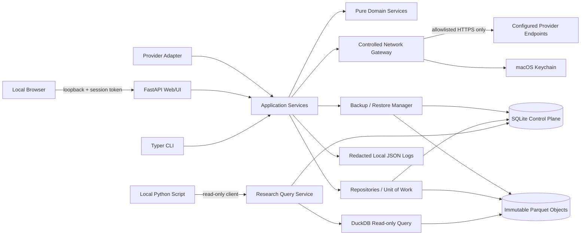
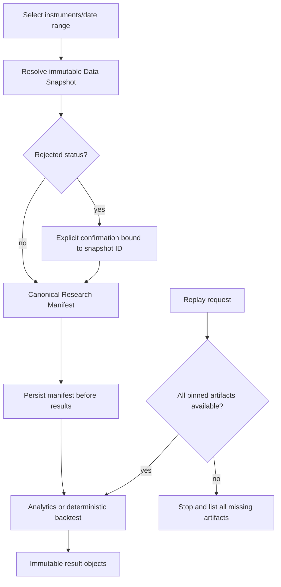
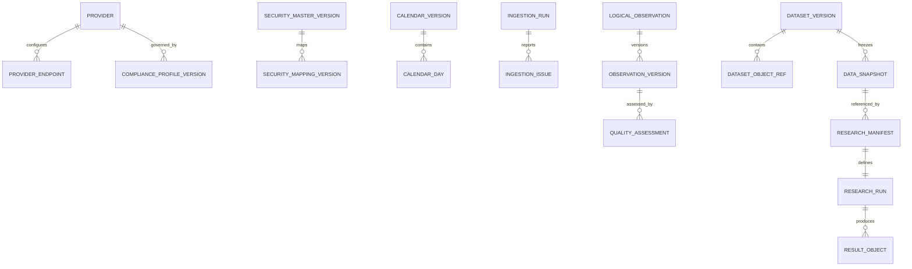

# Design Document: Personal Stock & Fund Analysis Platform

## Overview

本设计实现一个面向 macOS、单用户、本地部署的股票与基金研究 MVP。系统采用**模块化单体**：一个 Python 应用进程承载 Web/API、CLI 用例、摄取、质量、研究和回测模块；SQLite 保存强一致控制面元数据，不可变 Parquet 文件保存版本化日频事实，DuckDB/Arrow 提供只读分析。所有写入通过统一应用服务串行化，外部行情访问只能经过受控网络网关。

设计目标：

1. 以 `Canonical_Security_ID`、有效期映射、版本化日历和显式时区统一 A 股、港股、ETF 与开放式基金语义。
2. 将供应商原始值、规范化值、复权因子、质量结果和研究产物分层保存，所有研究运行绑定不可变快照和清单。
3. 回测只接受日频、完成交易日数据；信号最早在下一适用开市日执行，禁止做空、杠杆、盘中执行和衍生品。
4. 默认无遥测、无云服务、无券商连接、无下单能力；凭据保存在 macOS Keychain，所有出站请求做端点与重定向校验。
5. 优先选择易安装、易备份、可被一个实现 agent 完整交付的技术，不复制大型量化平台的全栈架构。

### MVP 边界

首期实现日频摄取、版本化存储、质量检查、基础分析、脚本只读查询、研究清单和确定性回测。明确不做：实时/分钟/逐笔数据、自动交易或券商连接、做空/杠杆/衍生品、多用户与远程部署、公开数据服务、参数寻优、机器学习流水线、分布式任务系统、第三方插件沙箱以及完整点时成分股数据库。

### 设计原则

- **本地优先**：服务仅绑定 `127.0.0.1`，数据目录位于当前 macOS 用户目录，除显式启用的供应商端点外不出站。
- **控制面/数据面分离**：SQLite 负责身份、版本、状态与引用；Parquet 负责不可变事实；文件先写暂存区并校验，再由 SQLite 事务发布。
- **追加而非覆盖**：主数据、映射、日历、合规档案、观测、质量评估、快照、研究清单和报告均以新版本表达变化。
- **显式语义**：日期、时区、复权、质量状态、缺失原因、成本模型及回测限制必须进入 API 结果和研究清单。
- **核心纯函数化**：日期映射、规范化、质量规则、复权、统计量、交易记账和 manifest 哈希尽量实现为无 I/O 的领域函数，便于属性测试。
- **可信适配器边界**：MVP 只运行随应用发布或由本地用户显式安装并加入允许列表的适配器；恶意 Python 包的 OS 级沙箱属于未来扩展。

### 开源技术评估与采用范围

以下内容只借鉴可验证的成熟思路，不复制外部项目的整体架构。外部资料内容均已为许可合规而改写。Content was rephrased for compliance with licensing restrictions.

| 资料 | 适用点 | 采用/不直接采用的原因 |
|---|---|---|
| [DuckDB 文档](https://duckdb.org/docs/current/) 与 [Apache Arrow Parquet 文档](https://arrow.apache.org/docs/python/parquet.html) | 本地列式文件查询、谓词下推、Arrow 交换 | 采用 DuckDB 作为嵌入式只读查询引擎、Parquet 作为事实文件；不把 DuckDB 同时作为控制面事务库，避免把元数据迁移、业务约束和分析扫描耦合。 |
| [Polars Parquet 扫描](https://docs.pola.rs/api/python/stable/reference/api/polars.scan_parquet.html) | 懒执行与列裁剪 | 作为后续性能替换参考；MVP 不同时引入 Polars 与 pandas 两套 DataFrame 语义，核心计算先用 NumPy/Arrow，脚本兼容 pandas。 |
| [FastAPI 大型应用组织](https://fastapi.tiangolo.com/tutorial/bigger-applications/) | 路由模块化、Pydantic 契约、OpenAPI | 采用 FastAPI 作为本机 API 外壳；业务规则不写在路由中。 |
| [Streamlit 本地客户端/服务端架构](https://docs.streamlit.io/develop/concepts/architecture/architecture) | 快速构建数据应用 | 仅借鉴交互式分析体验；不直接采用其脚本重跑状态模型作为核心 UI，以免摄取、确认和研究运行等有副作用流程与页面重跑耦合。MVP 使用 FastAPI + Jinja2/HTMX + Plotly。 |
| [PyPA 插件发现指南](https://packaging.python.org/en/latest/guides/creating-and-discovering-plugins) | 通过 entry points 发现独立分发的 provider adapters | 采用 entry-point 发现，但发现不等于启用；契约版本、显式允许列表与能力探测通过后才可调用。 |
| [Python keyring 文档](https://keyring.readthedocs.io/en/latest/index.html) | macOS Keychain 凭据后端 | 采用 `keyring` 保存凭据引用；SQLite、日志、报告和默认备份不保存明文。 |
| [HTTPX 文档](https://www.python-httpx.org/) | 同步/异步 HTTP、超时和事件钩子 | 采用单一受控客户端；禁用自动重定向，每跳验证目标后再继续，适配器不能接收凭据明文。 |
| [SQLite Backup API](https://sqlite.org/backup.html) 与 [Alembic SQLite 批迁移](https://alembic.sqlalchemy.org/en/latest/batch.html) | 在线一致性备份、可审计 schema 迁移 | 采用 SQLite backup + 文件清单校验；迁移必须先生成并验证可恢复备份。 |
| [Qlib 工作流示例](https://github.com/microsoft/qlib/blob/main/examples/workflow_by_code.py) | 数据集、研究工作流、记录器分离 | 借鉴“快照 + 运行清单 + 结果”的可复现边界；不引入其 ML、因子、组合优化和完整工作流栈。 |
| [Zipline 文档](https://zipline.ml4trading.io/) | 事件驱动回测和交易日推进 | 借鉴按交易日推进和延迟执行；不采用其资产数据库、bundle 摄取及订单系统，因为 MVP 只需日频、多头、零杠杆。 |
| [backtesting.py API](https://kernc.github.io/backtesting.py/doc/backtesting/) 与 [vectorbt 用法](https://vectorbt.dev/getting-started/usage/) | 简单策略接口、向量化研究 | 作为策略 API 和报告体验参考；不直接作为内核，因本需求的点时日历、不可交易状态、缺价政策、版本清单和零成交原因需要更严格的自有领域模型。 |
| [AKShare 项目](https://github.com/akfamily/akshare) | 中国市场数据接口覆盖 | 可做独立适配器候选，不作为规范数据模型或许可依据；上游字段、来源和可用性变化必须由适配器契约、合规档案和集成测试隔离。 |

## Architecture

### 总体架构



### 模块化单体边界

建议包结构：

```text
src/stock_platform/
  web/                 # FastAPI 路由、Jinja2/HTMX 视图、CSRF/本地会话
  cli/                 # Typer 命令；只调用 application use cases
  application/         # 命令/查询、事务边界、DTO、权限与确认流程
  domain/
    identifiers.py     # 规范标识与有效期映射
    calendars.py       # 日期解释与缺口分类
    compliance.py      # 合规档案与许可决策
    ingestion.py       # 规划、规范化、版本决策
    adjustments.py     # 因子校验与价格变换
    quality.py         # 规则、严重度、报告
    analytics.py       # 收益/波动/回撤/均线/相关性
    research.py        # 快照、manifest、重放比较
    backtest.py        # 确定性事件循环与账本
  providers/           # 契约、发现、内置/参考适配器
  infrastructure/
    sqlite/            # SQLAlchemy repositories + Alembic
    parquet/           # PyArrow 写入、哈希、对象发布
    query/             # DuckDB 只读查询与 10k 限制
    network/           # HTTPX、端点策略、重定向、速率错误
    secrets/           # keyring、遮蔽器
    backup/            # 快照、校验、恢复、加密凭据胶囊
    observability/     # JSON 日志、状态与诊断
```

依赖方向固定为 `web/cli/infrastructure -> application -> domain`；`domain` 不导入 FastAPI、SQLAlchemy、DuckDB、HTTPX 或 keyring。Provider adapter 实现依赖公开契约，不访问 repository。

### 部署拓扑与运行约束

- Python 3.12 虚拟环境，依赖由 lockfile 固定；支持 Apple Silicon 与 Intel macOS。
- 单进程启动 Web 服务，绑定 `127.0.0.1`；不监听局域网接口。CLI 可短进程运行，通过同一应用层和文件锁访问数据。
- 启动时记录安装目录所有者的 UID。每个请求和 CLI 命令校验当前 effective UID；不同 UID 立即返回 `SECOND_USER_DENIED`，不打开写事务。
- `run/writer.lock` 保证同一时刻只有一个写者；同一用户可打开多个浏览器标签，但副作用命令带幂等键和 CSRF token。
- 本地路径：
  - `~/Library/Application Support/StockResearch/control.sqlite3`
  - `~/Library/Application Support/StockResearch/objects/sha256/<prefix>/<hash>.parquet`
  - `~/Library/Application Support/StockResearch/manifests/`
  - `~/Library/Application Support/StockResearch/backups/`
  - `~/Library/Logs/StockResearch/app.jsonl`
  - 凭据：macOS Keychain service `stock-research/<provider>/<credential-name>`。
- 无后台常驻调度器；摄取、质量检查、备份和回测由用户触发，在进程内作为可取消任务执行。任务状态写 SQLite，崩溃后可恢复摄取，不引入 Celery/Redis。

### 技术选型

| 关注点 | 选择 | 取舍 |
|---|---|---|
| API/页面 | FastAPI + Pydantic v2 + Jinja2/HTMX + Plotly | 保持 Python 单体与明确 API；比 SPA/Node 简单，比 Streamlit 更适合有副作用工作流。 |
| CLI | Typer | 与 Pydantic DTO 共用，便于脚本化备份、摄取、研究和状态检查。 |
| 控制面 | SQLite + SQLAlchemy 2 + Alembic；WAL、foreign keys、busy timeout | 单用户零运维；写入串行，不为未来多用户提前引入 PostgreSQL。 |
| 数据面 | PyArrow Parquet，不可变、内容寻址 | 压缩、列裁剪、跨工具；小批次文件通过摄取完成时压实，避免碎片化。 |
| 查询 | DuckDB 只读连接 + Arrow 输出 | 可直接查 Parquet；查询前由平台生成允许的关系和参数，不暴露任意文件路径或写 SQL。 |
| 数值分析 | NumPy + pandas 兼容输出 | 成熟量化生态、公式透明；核心函数用 ndarray/Arrow，避免依赖 pandas 隐式索引语义。 |
| HTTP | HTTPX，经 `NetworkGateway` | 集中 TLS、超时、重试、限速分类、重定向和遮蔽。 |
| 凭据 | keyring/macOS Keychain | 不落项目文件；仅网关按 credential reference 取用。 |
| 测试 | pytest + Hypothesis + time-machine/freezegun 类时钟注入 | 示例测试覆盖工作流，属性测试覆盖纯领域不变量。 |

### 关键运行流

#### 摄取、版本化与发布

```mermaid
sequenceDiagram
    actor U as Local User
    participant A as Application Service
    participant C as Compliance/Calendar/Registry
    participant P as Provider Adapter
    participant G as Network Gateway
    participant Q as Quality Service
    participant F as Parquet Object Store
    participant D as SQLite

    U->>A: ingest(instrument, inclusive range, refresh?)
    A->>A: validate UID, range, storage, adapter/version
    A->>C: verify compliance + resolve ID/calendar
    A->>A: compute maximal missing segments or full refresh dates
    A->>P: build provider request
    P->>G: ProviderRequest(no plaintext credential)
    G->>G: validate endpoint; resolve credential; redact metadata
    G-->>P: response or categorized error
    P-->>A: RawBatch + provenance
    A->>C: timestamp/date mapping + normalization
    A->>Q: validate each candidate
    A->>A: classify identical/changed/rejected/unresolved
    A->>F: write temp Parquet; fsync; hash; atomic publish
    A->>D: transaction: versions, object refs, counts, report, boundary
    D-->>A: commit
    A-->>U: ingestion summary
```

发布协议：

1. 在任何网络调用前完成用户、范围、端点、合规档案、凭据可用性和磁盘预算检查。
2. 非 refresh 请求基于快照与适用日历计算“预期但缺失”的日期集合，并压缩为最大连续片段；refresh 请求覆盖范围内全部预期日期。
3. 原始响应仅在合规档案允许时写入加密/受保护的原始对象；`retention=prohibited` 时仅在内存处理并返回非持久化结果，不创建规范化事实、数据集版本或快照。
4. 候选行先解析标识和本地日期，再做结构与质量校验。缺字段、无映射、歧义映射和拒绝记录进入 run issue ledger，不进入 accepted canonical facts。
5. 与当前逻辑观测字段完全相同则复用原版本 ID；字段不同则创建一个指向直接前版的 `observation_version`。旧版本不更新。
6. Parquet 临时文件校验 schema、行数和 SHA-256 后原子重命名至内容寻址目录；随后 SQLite 单事务发布引用。事务失败只留下可安全清理的无引用对象，不产生半发布数据集。
7. 运行中断保留已提交批次，记录最早未 finalized 的预期日期；恢复只请求该边界起本次运行尚未 finalized 的日期。
8. `requested = accepted + warning + rejected + unresolved`；分类互斥。provider 在完成前失败则 `incomplete=true` 并保留失败前 finalized 的数据。

#### 快照、研究与重放



`Data_Snapshot_ID = sha256(canonical_json(snapshot_manifest))`。`Research_Run_ID` 使用 UUIDv7；manifest 先写入并提交，再允许结果发布。重放不解析“latest”，只解析 manifest 中的具体对象哈希、日历/因子/规则/逻辑/环境版本。离散输出字节级相同；浮点比较容差按需求 `1e-10 * max(1, abs(original))`。

#### 确定性回测与防前视

回测按 `(trading_date, canonical_security_id)` 稳定排序推进。策略在日终阶段只能读取 `date <= d` 且质量/缺失政策允许的数据；由 d 日完成数据产生的信号进入 pending 队列，最早执行日为 manifest 日历中严格晚于 d 的首个适用开市日。MVP 统一使用所选复权模式下该执行日的开盘价作为模拟价，并在报告中标明这是合成研究口径；不会混用另一复权模式。

```text
for d in calendar.open_dates:
    visible = market_view(snapshot, through=d)          # cannot access future rows
    signals = strategy.on_day_close(d, visible)
    reject_entire_run_if unsupported_capabilities(signals)
    enqueue(signals, earliest_execution=next_open(d))

    for request in stable_order(executable_on=d):
        if tradability blocks direction: record zero fill
        elif price missing: record zero fill
        elif buy cash < gross + costs: record zero fill
        elif sell quantity > holding: record zero fill
        else: fill at selected-mode open; apply itemized costs
        assert cash >= 0 and all positions >= 0

    value_at_close(d, selected_missing_price_policy)
```

若策略在任何日期请求做空、杠杆、盘中执行或衍生品，运行在执行前完成全量能力预检，执行零笔交易并保留初始账本。交易可用性先于资金判断；零成交也产生带原因的 execution record。五日回看按适用**开市会话**计数而非自然日。

## Components and Interfaces

### 1. Local Access Guard

职责：验证 effective UID、安装所有者、loopback 来源、会话 token、CSRF、写者锁和幂等键。不同用户、未来能力请求或未配置端点在进入业务事务前失败。系统不定义任何 broker/order port，API schema 也没有创建、改单、撤单或执行真实订单的类型。

### 2. Provider Registry, Adapter Contract 与 Network Gateway

适配器通过 entry-point group `stock_platform.providers` 被发现，声明一个且仅一个契约版本。平台支持的首期契约为 `1.x`；兼容规则是主版本相等且适配器次版本不高于平台声明的最大次版本。发现、兼容、允许列表、启用是四个独立状态。

```python
from dataclasses import dataclass
from datetime import date, datetime
from decimal import Decimal
from typing import AsyncIterator, Literal, Mapping, Protocol

InstrumentType = Literal["A_SHARE", "HK_EQUITY", "ETF", "OPEN_END_FUND"]
DataKind = Literal["DAILY_BAR", "FUND_NAV", "SECURITY_MASTER", "CALENDAR", "ADJUSTMENT_FACTOR", "TRADABILITY"]

@dataclass(frozen=True)
class CapabilityValue:
    value: object | None
    reported: bool                 # false => UI displays "unknown"

@dataclass(frozen=True)
class ProviderCapabilities:
    markets: CapabilityValue
    instrument_types: CapabilityValue
    fields: CapabilityValue
    date_ranges: CapabilityValue
    request_limits: CapabilityValue

@dataclass(frozen=True)
class ProviderRequest:
    provider: str
    endpoint_id: str               # resolves to configured HTTPS origin/base path
    credential_ref: str | None     # never credential content
    category: str
    method: Literal["GET", "POST"]
    relative_path: str
    query: Mapping[str, str]
    body: bytes | None
    timeout_seconds: float

@dataclass(frozen=True)
class ProviderEnvelope:
    provider: str
    provider_identifiers: tuple[str, ...]
    source_version: str | None
    correlation_id: str | None
    retrieved_at: datetime
    payload: bytes                 # consumed in memory unless retention allows raw storage

class ProviderAdapter(Protocol):
    name: str
    contract_version: str          # exactly one declared version
    def auth_schema(self) -> Mapping[str, object]: ...
    async def capabilities(self, gateway: "NetworkGateway") -> ProviderCapabilities: ...
    async def fetch(self, request: "CanonicalFetch", gateway: "NetworkGateway") -> AsyncIterator[ProviderEnvelope]: ...
    def normalize(self, envelope: ProviderEnvelope) -> list["ProviderRow"]: ...
```

契约明确：认证需求、能力发现、请求类型、规范响应、rate-limit 信号和错误分类。`ProviderRow` 必须携带 provider-specific ID 与 envelope provenance，直到 canonical observation 形成。

`NetworkGateway` 是唯一拿到凭据明文和创建 HTTPX client 的组件：

- endpoint 配置保存标准化 HTTPS scheme、IDNA host、显式端口和允许 base path；拒绝 URL userinfo、非 HTTPS（测试 fixture 除外）、IP 字面量和与配置不一致的解析结果。
- DNS 解析后拒绝 loopback、link-local、multicast、私网和保留网段，除非测试环境显式注入 fake transport；连接前与每次重试前复核。
- `follow_redirects=False`；收到 3xx 后先解析并验证下一跳，再决定是否重发。跨 origin 不转发 Authorization、Cookie、请求体或供应商数据。
- 日志只记录 endpoint ID、脱敏 host、请求类别、状态、耗时、重试资格和 provider correlation ID；query/body 在 SecretRedactor 后才能持久化。
- rate-limit 错误包含 provider、request category、retry eligibility、可选 retry-after 与 provider correlation ID。自动重试只对幂等请求、明确可重试且在供应商限额内执行；摄取状态仍记录每次尝试。
- replacement adapter 只有在契约、能力与最小探测全部成功后才原子切换；失败保持旧 adapter enabled。

### 3. Compliance Service

负责字段长度、枚举、目的集合 1..4 且去重、时间精度和 UTC offset `[-12:00,+14:00]` 校验。每次变更插入不可变版本；更新/删除历史版本的 repository API 不存在。`ComplianceDecision` 在网络请求、原始保存、规范化保存和导出前分别求值，决定 `ALLOW`、`PROCESS_EPHEMERALLY` 或 `DENY`。导出是按 `DERIVED_RESULTS`、`NORMALIZED_PROVIDER_DATA`、`RAW_PROVIDER_DATA` 明确分类，不根据文件后缀猜测。

### 4. Identifier Registry

规范 ID 建议格式 `urn:stock-research:{market}:{instrument_type}:{base32_uuid}`，由数据库唯一约束保证 `(market, instrument_type, market_local_code)` 与 canonical ID 一一对应。Security Master 和 mapping 都是 `[valid_from, valid_to]` 闭区间版本。

解析 API：

```python
resolve(provider, provider_identifier, observation_date) ->
    Resolved(canonical_security_id)
  | Unresolved(inputs)
  | Ambiguous(matches=[(canonical_security_id, valid_from, valid_to), ...])
```

数据库允许保存历史脏数据以供诊断，但写服务拒绝同一 provider/id/date 的重叠 mapping；解析器仍实现多匹配分支，防止迁移或导入造成静默误配。生命周期变化不改变 canonical ID。

### 5. Calendar Service

Trading/Valuation Calendar version 各自有 market、IANA timezone、闭区间有效期和唯一 ID；同市场版本区间不得重叠。对 observation timestamp，服务用每个候选版本的 timezone 转换并检查 local date 是否落入版本有效期，必须恰有一个匹配版本，否则返回 missing/ambiguous error。Daily Bar 只能落在 open day；Fund NAV 只能落在 expected valuation day。

缺口分类优先级：

1. trading calendar closed → `EXPECTED_CALENDAR_GAP`；
2. open 且 tradability suspended → `SUSPENDED_TRADING_GAP`；
3. open 且 tradability missing/unknown → `UNRESOLVED_GAP`；
4. valuation expected 且 NAV absent → `DELAYED_OR_MISSING_VALUATION`。

每个缺失日期恰有一个 reason code；series 结果保留该日期的空值占位。

### 6. Ingestion Service

`IngestionPlanner` 是纯函数，输入 snapshot 已有日期、calendar expected dates、闭区间和 refresh 标记，输出有序的请求片段。`Normalizer` 使用 `Decimal` 解析供应商数字，禁止二进制浮点先行舍入；货币值保存 `decimal128(38, 10)`，volume 保存非负 `int64` 或 decimal（由 provider capability 声明）。

Daily Bar 原子校验全部字段：`price > 0`、`high >= open/low/close`、`low <= open/close/high`、`volume/turnover >= 0`、日期 open。Fund NAV 要求 expected date、`unit_nav > 0`；可选 cumulative NAV 必须 `> 0` 且 `>= unit_nav`，否则整条记录拒绝。At most one 当前逻辑事实由 SQLite 唯一索引和发布服务共同保证。

### 7. Adjustment Service

原始价格永不更新。统一 canonical cumulative factor `c_t > 0`，来源为一个 provider factor series 或由明确 Corporate Action 规则生成的单一版本序列。对 raw price `p_t`：

```text
unadjusted:       p'_t = p_t
forward-adjusted: p'_t = p_t * c_t / c_last
backward-adjusted:p'_t = p_t * c_t / c_first
```

`c_last`/`c_first` 来自请求区间所属完整 factor series 的固定锚点版本，而非随查询子区间改变；因此子区间查询与完整区间切片一致。OHLC 使用同一日因子；volume/turnover 不在 MVP 内反向调整。缺日期或非正因子使整个请求 series 为 rejected，不返回部分调整值。结果总是附带 mode、source、factor version。开放式基金不经过此服务；只返回 provider unit NAV 及可选 provider cumulative NAV。

### 8. Data Quality Service

质量规则以 `rule_id + semantic_version + severity` 版本化。检查包括唯一性、必填 OHLCV/turnover、OHLC 顺序、正值/非负值和适用日历。Issue 固定记录 security ID、date、field、typed observed value 或 missing marker、rule ID/version、缺失依赖。观察状态取最大严重度 `VALID < WARNING < REJECTED`。

摄取时被结构/数值拒绝的候选只进入 issue ledger；已接受事实可在新规则版本重评后得到 REJECTED 质量评估，因此后续 snapshot 可能包含 rejected observation。Research Runner 针对此情况要求与 snapshot ID 绑定的一次显式确认。

### 9. Research Interface 与 Analytics Service

Research Interface 只开放白名单实体与字段的参数化查询，不允许 DDL/DML、任意 SQL、任意文件函数或文件路径。查询 DTO 最多 20 个 filter，固定稳定排序，读取一个 Data Snapshot，硬截断 10,000 行并额外探测一行设置 `has_more`。返回 snapshot ID、原查询参数、filter count、returned count 和 `has_more`。

```python
@dataclass(frozen=True)
class ResearchQuery:
    entity: Literal["security_master", "daily_bar", "fund_nav", "trading_calendar", "adjustment_factor", "quality_status"]
    snapshot_id: str
    fields: tuple[str, ...]
    filters: tuple["Filter", ...]  # <= 20, typed operators only
    order_by: tuple[str, ...]
    limit: int = 10_000             # caller may request less, never more
```

分析函数显式丢弃 missing 后按日期稳定排序，并严格实现需求公式：

- periodic return 只连接相邻的非缺失观测；输出显示该约定。
- volatility 用样本标准差 (`n-1`) 与 `sqrt(252)`。
- drawdown 只对正的非缺失值使用截至当日的 running max。
- moving average 对非缺失观测计数，窗口前显式 missing。
- correlation 只取共享非缺失日期，任一方平方离差和为零则 undefined。

输入不足、窗口非法或相关性未定义都返回 typed result，并保留 UI 上一次成功结果。

### 10. Snapshot / Research Runner

Runner 负责：冻结 snapshot、确认 rejected data、构造 canonical manifest、先持久化 manifest、调用纯研究逻辑、写不可变结果、重放和差异比较。canonical JSON 使用 UTF-8、排序键、无非有限浮点、日期/时间 ISO-8601 与显式 offset；浮点参数同时保存十进制字符串表示，避免平台 JSON 差异。

`dependency_environment_id = sha256(lockfile + python_version + platform_arch + numeric_runtime_versions + application_build)`。策略源代码/包 wheel 的 SHA-256 构成 `research_logic_version`；工作树未提交不是禁止条件，但其内容哈希必须进入 manifest。

### 10.5 AI Research Workflow

AI 是研究使我们能更快的辅助层，不是自由聊天、行情代理或决策引擎。默认实现 `LocalEvidenceReasoner` 在本地运行，调用与查询 UI 相同的白名单查询结果；流程完全不联网，也不将凭据、文件路径或未选中的数据库行送入模型。请求必须携带已冻结的 `snapshot_id`，并在 `OVERVIEW`、`RANGE`、`CENTRAL_TENDENCY`、`VOLATILITY` 四个 feature intent 中选择。

AI workflow 生命周期是一次显式请求触发，固定五阶段依次生成五个独立可审计分析：

1. `INGESTION_READINESS`：检查 pinned manifest 数据量、对象数、quality rule set 与 cutoff，说明数据是否已具备研究起点。
2. `DATA_QUALITY`：明确证据仍受 pinned rule set 和 cutoff 约束，避免把未确认数据混入研究。
3. `RESEARCH_REVIEW`：使用同一实体/过滤器生成 bounded metric evidence（先使用 range 视角）。
4. `RISK_DECISION`：生成 dispers ion 视角（variance/standard deviation），输出为研究摘要而非投资建议。
5. `REPORT_BRIEFING`：汇总前序阶段，将中心趋势作为报告导入口。

每个 AI artifact 记录 model/provider 版本、prompt template 版本、rule set 版本、行数、过滤器和 `result_sha256`。finding 只引用 evidence ID，metric 只来自固定规则（估算范围、均值、中位数、方差）。无数据或指标不可用时输出 `INSUFFICIENT_EVIDENCE`；模型不会用外部市场知识补全。`analysis_id = ai-sha256:<canonical json digest>`，相同输入必然产生相同 artifact，并进入本地备份清单。

全部阶段必须在 application 编排层完成 snapshot/query validation、record count、boundhash 和错误拒绝。Reusable provider registry 使用 stable provider ID 路径：

1. `AIProviderBinding(provider_id, provider)` 转换一个写入 `AIResearchProvider` port 的模型到 registry entry。
2. `AIProviderRegistry.resolve(provider_id_or_none)` 将缺省 ID 解析到一个 provider；不预置 HTTP provider，默认执行完全本地。
3. 每个路由/CLI 请求带有可选 `provider_id`；该值只选择 registry 中已出现的 binding，never 自行执行 exec/eval/import。
4. 新增 provider 必须填 model ID/version、prompt version、rule set version，创建 provable `AIAnalysisArtifact`，保留 evidence ID 和 content-addressed ID。

用户托管的远端模型的推荐接入是 `RemoteEvidenceReasoner`：

1. 先用 `LocalEvidenceReasoner` 构建 metrics、evidence hash 与 findings（仍无联网）。
2. 将 canonical metrics/limitations 打包为 prompt，而不发送 raw rows、SQL、路径、文件内容或凭据。
3. provider adapter 的 transport client 负责 endpoint、TLS/rebinding、rate limit/timeout 与 credential separation。
4. 远端 text 称为 summary/简报。原始 findings/metrics/evidence 不被模型 overwrites；若 provider 返回非 schema 文本，则必须抛 typed contract error。

### 11. Backtest Engine

组件分为 `StrategyProtocol`、`MarketView`、`SignalValidator`、`ExecutionSimulator`、`Ledger`、`ValuationService` 和 `ReportBuilder`。策略只输出目标数量或买卖请求，不接触 repository、network 或未来游标。

```python
class Strategy(Protocol):
    api_version: str
    required_capabilities: frozenset[str]
    def on_day_close(self, ctx: "DayContext") -> tuple["Signal", ...]: ...

@dataclass(frozen=True)
class DayContext:
    trading_date: date
    history: "AsOfMarketView"       # enforces row.date <= trading_date
    positions: Mapping[str, Decimal]
    cash: Decimal

@dataclass(frozen=True)
class CostModel:
    commission_rate: Decimal
    tax_rate: Decimal
    slippage_bps: Decimal
    minimum_fee: Decimal
```

成本按显式顺序计算并逐项记录：slippage 调整执行价；gross=`abs(qty*price)`；commission=`max(minimum_fee, gross*rate)`（零成交为零）；tax 按方向/市场配置；total 为各项之和。买入需 `cash >= gross + total`；卖出数量不得超过持仓。每步使用 Decimal 并按 manifest 中市场货币精度和 rounding mode 量化，报告性能序列最后才转 float。

Backtest Report 分四段：signal generation、simulated execution、portfolio valuation、performance calculation；披露范围、universe、benchmark、mode、cost、missing policy、tradability coverage、survivorship warning、warning/rejected observations 和研究估计免责声明。

### 12. Credential Manager / Secret Redactor

凭据值只在 Network Gateway 的最小作用域内从 Keychain 读取。Redactor 在 display/log/export/report/persist metadata 的最终 sink 前执行，匹配：完整 credential、URL-encoded/base64 派生值、常见 auth header/query 形式；输出固定 `[REDACTED]`。运行时维护 credential-derived token 集，日志 formatter 仍做第二次深度遍历。

删除 provider 配置时先列出关联 credential refs，用户逐项选择；删除事务只删选中 Keychain item，未选中项保留。凭据缺失/不可访问时网关在建连前失败。

### 13. Backup, Restore 与 Migration Manager

默认备份不含明文凭据，包含 requirements 指定的全部允许项目。流程：获取写锁 → SQLite backup 到 temp → 枚举所有被引用对象 → 逐文件复制/硬链接到 temp → 生成每数据集 record count 与 SHA-256/Merkle checksum → 独立重读验证 → 原子发布目录并标记 restorable。可选 credential capsule 使用用户提供的备份口令经 scrypt 派生密钥并以 AES-256-GCM 加密；任何加密失败删除本次 temp。

恢复先校验 schema compatibility、manifest、全部 counts/checksums；再将当前状态原子重命名为 rollback bundle，恢复到新目录，重新验证后切换。任一步失败切回完整 pre-restore 目录。成功也保留 rollback bundle，直到用户确认或下一次成功备份。

迁移由 Alembic revision + `data_layout_version` 协调：任何 schema/data layout 变更前必须创建上述 restorable backup；在复制出的工作目录执行迁移并验证，再原子切换。SQLite 迁移使用 batch mode。应用报告当前 schema 与明确的 restore-compatible schema 集合，不做隐式跨不兼容恢复。

## Data Models

### 存储分层



### SQLite 控制面

所有表使用显式 UTC `created_at`（微秒内部精度；对外需求字段按秒验证/呈现）、foreign keys、不可变版本 trigger（仅允许插入；状态机表除外）。关键表：

| 表 | 关键字段与约束 |
|---|---|
| `platform_identity` | 单行 `owner_uid`, install ID, installed version；owner 不可变。 |
| `provider`, `provider_endpoint`, `adapter_installation` | provider name；标准化 endpoint；adapter package/version、单一 contract version、compatibility、enabled。 |
| `credential_reference` | provider、Keychain service/account、display label；无 secret。 |
| `compliance_profile_version` | provider、version、source、account type、purpose set JSON、retention/export enum、confirmed/changed timestamp；唯一 `(provider, version)`；append-only。 |
| `security_identity` | canonical ID、market、instrument type、local code；双向唯一约束。 |
| `security_master_version` | canonical ID、name、currency、listing/establishment、termination、status、valid interval；append-only。 |
| `security_mapping_version` | provider、provider ID、canonical ID、inclusive interval；写服务和触发器防重叠。 |
| `calendar_version`, `calendar_day` | type、market、IANA timezone、effective interval、version ID；同 market/type 防重叠；day state/session。 |
| `corporate_action`, `factor_series`, `factor_point` | security、source type/id、effective date、retrieval timestamp、positive Decimal、version。 |
| `ingestion_run` | request, refresh, status, counts, resumable boundary, provider failure；状态可从 RUNNING 到 COMPLETE/INCOMPLETE/FAILED。 |
| `ingestion_finalized_date` | run、security、data kind、expected date、outcome；恢复幂等键。 |
| `logical_observation` | security、data kind、observation date；唯一。 |
| `observation_version` | logical ID、version ID、previous version ID、object hash/row locator、normalized value hash、provenance；append-only。 |
| `quality_rule_set`, `quality_assessment`, `quality_issue` | rule/version、observation version、severity、field/value/dependency；评估 append-only。 |
| `dataset_version`, `dataset_object_ref` | parent dataset、manifest hash、Parquet object hash、row count、schema ID；append-only。 |
| `data_snapshot` | immutable snapshot ID/hash、dataset version、pinned master/calendar/factor/quality versions。 |
| `snapshot_confirmation` | snapshot ID、owner UID、confirmed at；只对该快照有效。 |
| `research_manifest`, `research_run`, `result_object` | manifest JSON/hash、run status、result hashes；manifest/results append-only。 |
| `backup_manifest`, `migration_history` | schema/layout versions、counts/checksums、verification/restorable status。 |

SQLite 不存大块行情 payload；raw response（若许可）与 canonical facts 都进入对象存储，SQLite 只存哈希和 provenance。

### Parquet 数据面

每个对象有固定 `schema_id`，文件级 metadata 包含 `schema_id`, writer version, created_at, row_count, logical min/max date, content checksum。按 `data_kind/market/year` 形成逻辑分区，但物理文件名只用 SHA-256；manifest 决定归属，目录名不承担身份语义。

`daily_bar.v1`：

```text
canonical_security_id: string
observation_date: date32
open/high/low/close: decimal128(38,10)
volume: decimal128(38,10)
turnover: decimal128(38,10)
currency: string
provider: string
provider_identifier: string
source_version: string?
retrieved_at: timestamp[us, tz=UTC]
observation_version_id: string
```

`fund_nav.v1`：同 provenance 字段，加 `unit_nav: decimal128(38,10)` 与 nullable `cumulative_nav`。Raw provider objects 使用 opaque bytes + sidecar manifest，仅在 retention 允许时存在。Quality、calendar、factor 也可定期物化 Parquet 供查询，但 SQLite 版本行是权威控制面。

### 快照与研究清单

```json
{
  "snapshot_id": "sha256:...",
  "dataset_version_id": "...",
  "objects": [{"sha256": "...", "schema_id": "daily_bar.v1", "rows": 123}],
  "security_master_versions": ["..."],
  "mapping_versions": ["..."],
  "calendar_versions": ["..."],
  "factor_series_versions": ["..."],
  "quality_rule_set_version": "...",
  "quality_assessment_cutoff": "..."
}
```

`ResearchManifest` 严格包含 Glossary 定义的全部字段：run ID、snapshot ID、security scope、date range、providers、calendar versions、adjustment mode、quality rule version、research logic version、parameters、dependency environment ID、generated time；另外保存 benchmark、cost model、missing-price policy、tradability coverage 和 deterministic seed（即使策略不用随机数也固定为 0）。

### 领域值对象与枚举

- `InstrumentType = A_SHARE | HK_EQUITY | ETF | OPEN_END_FUND`，无 OTHER。
- `AdjustmentMode = UNADJUSTED | FORWARD_ADJUSTED | BACKWARD_ADJUSTED`。
- `QualityStatus = VALID | WARNING | REJECTED`，定义总序。
- `TradabilityStatus = TRADABLE | SUSPENDED | PRICE_LIMITED_BUY | PRICE_LIMITED_SELL | TERMINATED | UNKNOWN`。
- `MissingPricePolicy = UNAVAILABLE | LAST_VALID_CLOSE_MAX_5_OPEN_SESSIONS`。
- `AccountType`, `PermittedPurpose`, `RetentionPermission`, `ExportPermission` 与 requirements 枚举逐字对应，不接受自由文本别名。
- 所有金额/价格/因子/数量使用 `Decimal` 值对象；API 以字符串传输，避免 JSON float 损失。
- 所有业务日期为 ISO `date`；时刻必须是 timezone-aware `datetime`。Compliance/request time 的输入精度恰为秒且 offset 合法，内部可保留微秒系统时间用于排序。

### 版本、幂等与不可变性

- 版本 ID 使用 UUIDv7，内容身份使用 SHA-256；二者用途不混淆。
- Observation `value_hash` 来自 canonical field/value 序列，不含 retrieval time；因此相同值重摄取复用版本，同时可在 ingestion provenance ledger 记录本次看见。
- 副作用命令接受 `idempotency_key`，结果表唯一约束 `(owner_uid, command_type, key)`。
- Append-only 表由 repository 不暴露 update/delete，并由 SQLite trigger 防御；状态机记录只允许列出的单向转换。
- 数据对象删除仅由显式维护命令处理，且必须证明没有 dataset/snapshot/backup/manifest 引用；MVP 不自动垃圾回收已发布对象。

## Correctness Properties

*A property is a characteristic or behavior that should hold true across all valid executions of a system-essentially, a formal statement about what the system should do. Properties serve as the bridge between human-readable specifications and machine-verifiable correctness guarantees.*

以下属性已对全部验收标准做测试性预分析并完成冗余反思：相同的原子性、区间解析、质量谓词、出站限制和恢复不变量被合并；UI 外观、外部服务、Keychain ACL、文件恢复和迁移顺序保留为示例、集成或 smoke 测试。

### Property 1: Local owner isolation

For all installed owner UIDs, current UIDs, and persisted platform states, access is permitted exactly when the current UID equals the owner UID; a denied distinct UID receives the single-user error and leaves every persisted state hash unchanged.

**Validates: Requirements 1.1, 1.2**

### Property 2: Configured endpoint confinement

For all outbound requests and redirect chains, every transmitted hop must match a locally configured provider endpoint; otherwise no credential, metadata, body, or provider data bytes are transmitted, the blocked target is reported, and platform state remains unchanged.

**Validates: Requirements 1.4, 1.5, 13.7**

### Property 3: Unsupported MVP capabilities are inert

For all requests containing one or more documented future capabilities, the result lists every unsupported capability, performs no market interaction, and preserves provider data, configuration, snapshots, and runs.

**Validates: Requirements 1.8**

### Property 4: Instrument classification is total and exclusive over the supported domain

For all supported instruments, exactly one classification in A_SHARE, HK_EQUITY, ETF, or OPEN_END_FUND is assigned, and no value outside that set is accepted.

**Validates: Requirements 2.1**

### Property 5: Daily Bar acceptance is equivalent to all canonical constraints

For all candidate Daily Bars and applicable calendars, a row is accepted if and only if its date is open, every price is positive, high is not below any OHLC value, low is not above open/close/high, volume and turnover are non-negative, and all required fields exist; otherwise the whole row is rejected, every failed constraint is reported, and prior facts are unchanged.

**Validates: Requirements 2.2, 2.6, 7.7, 9.2, 9.3, 9.4, 9.5, 9.6, 9.7**

### Property 6: Fund NAV acceptance is equivalent to all canonical constraints

For all candidate Fund NAV rows and applicable valuation calendars, a row is accepted if and only if its valuation date is expected, unit NAV is positive, all required fields exist, and any supplied cumulative NAV is positive and not below unit NAV; otherwise the complete row is rejected with the exact failed-constraint set and prior facts remain unchanged.

**Validates: Requirements 2.3, 2.4, 2.6, 7.7, 9.5, 9.7**

### Property 7: Unsupported coverage is non-mutating

For all requested market/instrument-type pairs and enabled adapter capability sets, absence of coverage returns that exact pair as unsupported and leaves the selected dataset unchanged.

**Validates: Requirements 2.5**

### Property 8: Current canonical observations are unique

For all sequences of Daily Bar and Fund NAV publications, each `(Canonical_Security_ID, data kind, observation date)` has at most one current logical observation, and any duplicate candidate is detected by the uniqueness quality rule.

**Validates: Requirements 2.8, 9.1**

### Property 9: Adapter contract declaration is singular and implemented

For all discovered adapters, loading succeeds only if the adapter declares exactly one contract version and implements every required member of that declared version.

**Validates: Requirements 3.1**

### Property 10: Capability reporting preserves known and unknown values

For all combinations of reported and unreported capability fields, the platform returns every reported value unchanged and marks every unreported value as unknown.

**Validates: Requirements 3.3**

### Property 11: Provider provenance survives normalization

For all accepted provider envelopes and normalized observations, provider name, every provider-specific identifier, source version when available, retrieval time, and association to the normalized row are preserved through persistence and query.

**Validates: Requirements 3.4, 7.4**

### Property 12: Rate-limit translation is complete

For all provider responses categorized as rejected or throttled by request limits, the adapter returns a rate-limit error containing provider, request category, retry eligibility, and the provider correlation identifier exactly when supplied.

**Validates: Requirements 3.5, 3.6**

### Property 13: Incompatible adapters cannot issue requests

For all declared and supported contract version pairs, an incompatible pair leaves the adapter disabled, performs zero provider requests, and reports both versions.

**Validates: Requirements 3.7**

### Property 14: Compliance validity is conjunctive and reports all violations

For all Compliance Profiles, validation succeeds if and only if every length, enumeration, purpose count/uniqueness, second-precision timestamp, and UTC-offset constraint succeeds; on failure the result identifies exactly all invalid fields, creates no version, and sends no provider request.

**Validates: Requirements 4.2, 4.8**

### Property 15: Compliance history is append-only

For all valid Compliance Profile change sequences, each change creates one new effective version with a valid change time, all prior versions retain their original values, and any prior-version modification or deletion request is rejected without changing datasets or history.

**Validates: Requirements 4.3, 4.9**

### Property 16: Export authorization follows the pinned profile version

For all export categories and Compliance Profile versions, output is produced only when that version permits the category; a denial references the applicable version, produces no bytes, and changes no persisted state.

**Validates: Requirements 4.5**

### Property 17: Retained raw data has complete compliance provenance

For all raw responses retained under `raw and normalized provider data`, the retained object is associated with provider, request parameters, applicable Compliance Profile version, and a second-precision request time with a legal explicit UTC offset.

**Validates: Requirements 4.6**

### Property 18: Canonical security assignment is a stable bijection

For all market/type/local-code combinations and lifecycle change sequences, repeated registration of the same combination returns the same Canonical Security ID, distinct combinations never share an ID, and status or termination changes never alter the assignment.

**Validates: Requirements 5.1, 5.2**

### Property 19: Identifier writes are valid or atomic failures

For all Security Master and Mapping inputs, a write succeeds only when required fields are nonblank, provider identifiers have 1..255 characters, instrument type is supported, dates are valid, and end is not before start; otherwise every invalid field is reported and no existing or new identity/mapping state changes.

**Validates: Requirements 5.3, 5.9**

### Property 20: Security mapping resolution is a trichotomy

For all providers, provider identifiers, observation dates, and mapping sets, resolution returns exactly one of: the sole matching Canonical Security ID, an unresolved result containing the inputs when there are zero matches, or an ambiguous result listing all matching IDs and intervals when there are multiple matches; non-singleton cases create no association.

**Validates: Requirements 5.4, 5.5, 5.6**

### Property 21: Security Master changes preserve complete history

For all security name, lifecycle, and mapping changes, one new effective-dated version is created, every prior version remains unchanged, and each Security Master view contains market, type, currency, listing/establishment date, termination date, and status.

**Validates: Requirements 5.7, 5.8**

### Property 22: Calendar version sets are valid and non-overlapping

For all Trading and Valuation Calendar version sets, registration succeeds only when every version has a unique ID, one market, one IANA timezone, a non-inverted inclusive interval, and no interval overlap with another version of the same calendar type and market.

**Validates: Requirements 6.1, 6.2**

### Property 23: Observation dates follow the uniquely applicable timezone

For all timezone-aware timestamps with exactly one applicable calendar version, the mapped trading or valuation date equals the local date obtained using that version's IANA timezone.

**Validates: Requirements 6.3, 6.4**

### Property 24: Non-unique calendar interpretation is rejected atomically

For all observation timestamps with zero or more than one applicable calendar version, date interpretation reports the calendar type and missing/ambiguous condition and leaves the canonical dataset unchanged.

**Validates: Requirements 6.5**

### Property 25: Every missing observation has exactly one precedence-defined reason

For all expected series dates and calendar/tradability states, an absent observation retains its expected date and receives exactly one reason: closed-day expected gap, otherwise open suspended gap, otherwise open missing/unknown tradability unresolved gap, or expected valuation delayed/missing gap.

**Validates: Requirements 6.6, 6.7, 6.8, 6.9, 9.12**

### Property 26: Non-refresh ingestion requests maximal missing segments

For all valid inclusive ranges, applicable expected dates, and existing snapshot dates, non-refresh planning expands to exactly the expected-minus-existing date set, and no two returned adjacent segments can be merged while preserving that set.

**Validates: Requirements 7.1**

### Property 27: Observation versioning is idempotent and linear

For all ingested observations sharing a logical key, equal normalized fields reuse the current logical observation and version ID without adding a version, while any nonempty normalized-field difference adds exactly one version whose predecessor is the immediately prior version and leaves all prior versions unchanged.

**Validates: Requirements 7.2, 7.3**

### Property 28: Ingestion outcome counts are exclusive and conserved

For all finalized ingestion candidate outcomes, each requested observation belongs to exactly one of accepted, warning, rejected, or unresolved, and their counts sum exactly to requested.

**Validates: Requirements 7.5**

### Property 29: Refresh planning ignores existing observations

For all valid ranges and current dataset contents, refresh planning requests exactly every applicable expected observation date in the range.

**Validates: Requirements 7.8**

### Property 30: Invalid ranges fail before network access

For all omitted, malformed, or inverted date boundaries, ingestion returns the supplied boundaries and violated condition, performs zero provider calls, and preserves the selected dataset.

**Validates: Requirements 7.9**

### Property 31: Resume planning is the finalized-date complement

For all incomplete runs, resumption requests exactly the expected dates not finalized for that run from the recorded boundary onward and preserves all pre-interruption logical observation and version IDs.

**Validates: Requirements 7.10**

### Property 32: Raw prices are immutable under adjustment operations

For all raw series, adjustment modes, factor updates, and adjusted-series generations, every stored Raw Value price remains equal to its provider-supplied value.

**Validates: Requirements 8.1**

### Property 33: Price requests require exactly one valid adjustment mode

For all A-share, HK equity, and ETF price requests, a series is returned only when exactly one of unadjusted, forward-adjusted, or backward-adjusted is selected; all other selections return no series and identify all three permitted modes.

**Validates: Requirements 8.2, 8.3**

### Property 34: Unadjusted prices are an identity transformation

For all valid raw price series, selecting unadjusted returns the same values in the same date/security order.

**Validates: Requirements 8.4**

### Property 35: Adjusted prices use one complete positive factor version

For all raw series and selected factor series, forward/backward adjustment returns values from the documented anchor formula using exactly one factor version if and only if every required effective date has a positive factor; otherwise quality is rejected, no adjusted values are returned, and the invalid series is identified.

**Validates: Requirements 8.5, 8.7, 8.8**

### Property 36: Adjustment factor provenance is exclusive and complete

For all stored Adjustment Factors, exactly one provider or Corporate Action source, one effective date, one retrieval time, and one version are present.

**Validates: Requirements 8.6**

### Property 37: Open-end fund cumulative NAV is provider-only with explicit fallback

For all Open-End Fund observations, cumulative NAV is returned only when provider-supplied; when absent, the provider unit NAV is returned unchanged and cumulative NAV is explicitly unavailable.

**Validates: Requirements 8.10, 8.11**

### Property 38: Quality issues contain complete evidence

For all failed quality rules, the issue record contains Canonical Security ID, observation date, affected field, typed observed value or missing marker, rule ID, and rule version.

**Validates: Requirements 9.8**

### Property 39: Quality severity is the maximum applicable severity

For all applicable rule outcomes, observation status equals the maximum under `VALID < WARNING < REJECTED`; unavailable required inputs produce the rule-version-defined warning or rejected status and name the unavailable input.

**Validates: Requirements 9.9, 9.10**

### Property 40: Quality reports are complete aggregations

For all completed quality checks, the report contains exactly the checked scope, rule-set version, recorded issues, resulting statuses, and generation time associated with that run.

**Validates: Requirements 9.13**

### Property 41: Periodic returns follow consecutive non-missing observations

For all date-ordered numeric series with at least two non-missing values, each output return equals `current / previous_non_missing - 1`, and missing observations neither create returns nor break the non-missing predecessor convention.

**Validates: Requirements 10.2**

### Property 42: Annualized volatility matches the stated sample formula

For all finite return series with at least two non-missing values, annualized volatility equals `sqrt(252)` times sample standard deviation with denominator `n-1`, within the numeric policy tolerance, and reports factor 252.

**Validates: Requirements 10.3**

### Property 43: Drawdown follows the running maximum

For all date-ordered positive non-missing value series, each drawdown equals the current value divided by the maximum value observed through that date minus one, and maximum drawdown equals the minimum pointwise drawdown.

**Validates: Requirements 10.4**

### Property 44: Moving averages use exactly w non-missing observations

For all numeric series and integer windows `1 <= w <= 10000`, output is explicitly missing until w non-missing observations are available and thereafter equals the arithmetic mean of the current and preceding `w-1` non-missing values.

**Validates: Requirements 10.5**

### Property 45: Correlation uses only aligned shared dates and rejects zero variance

For all two-series inputs, Pearson correlation with at least two shared non-missing dates and nonzero sums of squared deviations equals the stated formula; if either aligned series has zero variance, the result identifies every zero-variance series as undefined and preserves prior UI results.

**Validates: Requirements 10.6, 10.11**

### Property 46: Research queries are read-only

For all valid whitelisted Research Interface queries, hashes of the selected canonical dataset and every persisted control-plane record are identical before and after query execution.

**Validates: Requirements 10.7**

### Property 47: Query limits and result metadata are exact

For all Research Interface queries, at most 20 filters are accepted, at most 10,000 observations are returned, and successful results contain the input snapshot ID/parameters, applied filter count, returned count, and `has_more` equal to whether additional matches exist; over-limit filters are rejected without replacing prior results.

**Validates: Requirements 10.8, 10.9, 10.13**

### Property 48: Invalid analysis inputs preserve the previous result

For all supported calculations, inputs below the calculation's minimum observation count return exact required/available counts, and all non-integer or out-of-range moving-average windows return range 1..10000; neither case changes selected inputs or the previous successful analysis result.

**Validates: Requirements 10.10, 10.12**

### Property 49: Research manifests are complete and snapshots content-bound

For all created Research Runs, the manifest contains every Glossary-defined field, and each referenced immutable snapshot ID is the deterministic digest of its canonical snapshot manifest.

**Validates: Requirements 11.2, 11.3**

### Property 50: Replay uses only pinned artifacts and fails completely on absence

For all Research Manifests and artifact availability sets, replay resolves exactly the recorded snapshot, calendar, mode, quality rules, logic, parameters, and environment; if any are unavailable, it publishes no replay result and lists exactly every unavailable item.

**Validates: Requirements 11.4, 11.5**

### Property 51: Deterministic replay is equivalent within the specified numeric tolerance

For all deterministic Research Runs whose pinned artifacts are available, replayed discrete outputs equal originals exactly and every floating output satisfies `abs(replayed-original) <= 1e-10 * max(1, abs(original))`.

**Validates: Requirements 11.6, 11.7**

### Property 52: Manifest difference reports are exact

For all pairs of Research Manifests, the reported differing field set equals the actual differing field set and includes each differing value from both runs.

**Validates: Requirements 11.8**

### Property 53: Backtest ledgers remain long-only and solvent

For all supported market data, valid strategy signal sequences, and cost models, cash and every instrument position remain non-negative after every simulated event.

**Validates: Requirements 12.1**

### Property 54: Signals cannot use future or non-daily data

For all strategy signals, calendars, and data frequencies, only Daily Data through the completed signal date is visible, and the earliest scheduled execution is the first open session strictly after that date according to the manifest-pinned calendar; non-daily input is rejected.

**Validates: Requirements 12.2, 12.3, 12.4**

### Property 55: Filled-trade records reconcile with the cost model and ledger

For all filled simulated trades, the record contains requested/filled quantity, execution price, gross value, every configured cost component, total cost, and net cash change; recomputing from the pinned cost model exactly reconciles to the post-trade cash and position deltas under the currency rounding policy.

**Validates: Requirements 12.5, 12.6**

### Property 56: Blocked trades are zero-fill atomic operations

For all requested trades, a direction-blocking tradability status or insufficient purchase cash produces filled quantity zero, the exact reason, and no position or cash change.

**Validates: Requirements 12.7, 12.8**

### Property 57: Missing-price policies are exhaustive and bounded

For all missing valuation bars, exactly one of the two declared policies applies; unavailable policy marks dependent outputs unavailable, while fallback uses the most recent earlier valid close if and only if it is within five applicable open sessions, and the audit record contains instrument, date, policy, optional source date, and availability.

**Validates: Requirements 12.9, 12.10**

### Property 58: Backtest disclosures reflect all affected inputs

For all completed backtests, report disclosures equal the run's data range, universe, benchmark, mode, cost model, missing-price policy, and tradability coverage; any missing point-in-time membership triggers the named-universe survivorship warning, and every warning/rejected observation used is listed by security/date/status.

**Validates: Requirements 12.13, 12.14, 12.15**

### Property 59: Unsupported strategy requests execute nothing

For all nonempty subsets of short selling, leverage, intraday execution, and derivative capabilities, preflight returns every requested unsupported capability, executes zero trades, and preserves initial positions and cash.

**Validates: Requirements 12.16**

### Property 60: Secrets never reach observable or persisted sinks

For all credentials, recoverable encodings, nested content structures, and display/log/export/report/request-metadata sinks, output after redaction contains neither the credential nor any configured recoverable representation and uses the fixed redaction marker.

**Validates: Requirements 13.3, 13.8**

### Property 61: Credential deletion is exactly selective

For all provider credential sets and selected subsets, confirmation deletes exactly the selected credentials and preserves every unselected credential.

**Validates: Requirements 13.5**

### Property 62: Unavailable credentials prevent requests

For all absent or inaccessible required credentials, the adapter performs zero provider requests and returns a credential-unavailable error containing no credential content.

**Validates: Requirements 13.6**

### Property 63: Default backup inventory is complete and secret-free

For all platform states, a default backup includes exactly the required configuration (excluding plaintext credentials), master/mapping/calendar versions, permitted retained data, quality reports, snapshots, manifests, and research results referenced by its manifest.

**Validates: Requirements 14.3**

### Property 64: Storage preflight is exact

For all non-negative integer available and estimated byte counts, ingestion proceeds past preflight only when available is at least estimated; otherwise it sends no provider request and reports both values exactly.

**Validates: Requirements 14.6**

### Property 65: Restore eligibility requires complete compatibility and verification

For all backup manifests, schema compatibility values, and per-dataset count/checksum results, a backup is marked restorable and eligible for restore if and only if its schema is compatible and every dataset verification succeeds; rejection reports every failed condition and leaves pre-restore state unchanged.

**Validates: Requirements 14.8, 14.9**

## API and CLI Boundaries

### HTTP API

所有端点仅监听 loopback，版本前缀 `/api/v1`。Command endpoint 接受 `Idempotency-Key`，成功/错误都返回 `request_id`。主要边界：

| Method/Path | 用途 |
|---|---|
| `GET /status` | 安装、adapter/contract、schema/compatibility、storage、latest ingestion 状态。 |
| `GET /providers`, `POST /providers/{id}/configure`, `POST /providers/{id}/enable` | 供应商配置、能力与原子切换。 |
| `POST /providers/{id}/compliance-profiles` | 仅新增合规版本。无 update/delete 路由。 |
| `POST /credentials`, `DELETE /credentials/{ref}` | Keychain reference 管理；创建响应不回显 secret。 |
| `GET /securities`, `POST /securities/register`, `POST /security-mappings` | 主数据/映射查询与新增版本。 |
| `POST /ingestions`, `POST /ingestions/{id}/resume`, `GET /ingestions/{id}` | 摄取、恢复与进度。 |
| `POST /snapshots`, `POST /snapshots/{id}/confirm-rejected` | 快照冻结与显式确认。 |
| `POST /research/query` | 唯一公开的脚本查询入口；只读、typed filters、10k/20 限制。 |
| `POST /research/ai-analysis` | 本地 snapshots 内的 feature-scoped AI 解释；要求 pinned snapshot，返回 evidence 和 content ID。 |
| `POST /research/ai-workflow` | 五阶段 pinned AI lifecycle workflow；每个 stage 关联一个独立 content-addressed analysis。 |
| `GET /research/ai-providers` | 只读 provider IDs/default provider，如论 secret 或模型 endpoint details。 |
| `POST /analyses`, `POST /backtests`, `POST /research-runs/{id}/replay` | 研究运行；先落 manifest。 |
| `POST /exports`, `POST /backups`, `POST /restores` | 合规导出与本地恢复工作流。 |

不存在 `/orders`、`/brokers`、`/trades/live` 或任意真实交易 endpoint。OpenAPI 中的 `Trade` 仅位于 backtest report schema，命名为 `SimulatedExecution`，避免误解。

### CLI

CLI 与 HTTP 路由调用相同 application use cases，不复制业务逻辑：`stock-research status`、`provider list/configure/enable`、`compliance add`、`credential set/delete`、`security register/map`、`ingest start/resume/show`、`snapshot create/confirm`、`ai-provider-list`、`ai-analyze`、`ai-workflow`、`query`、`analyze`、`backtest run`、`research replay/diff`、`backup create/verify`、`restore`、`migrate`。`ai-analyze` 与 `ai-workflow` 可选 `--provider`；未填时使用 local evidence reasoner。所有查询命令支持 `--json`；secret 只通过隐藏输入或 stdin/file descriptor 读取，不接受命令行参数，避免 shell history 泄漏。无任何 order/broker 命令。

### Python 只读客户端

`stock_platform.client.open_snapshot(snapshot_id)` 返回只读 facade，只暴露 ResearchQuery、feature-scoped AI analysis 和 analytics 输入导出；不返回 SQLite connection、DuckDB write connection 或对象存储路径。脚本创建 Research Run 时必须经 Runner，不能自行发布 manifest/result。

## Error Handling

### 统一错误模型

```json
{
  "code": "UNCONFIGURED_PROVIDER_ENDPOINT",
  "category": "SECURITY_POLICY",
  "message": "Provider endpoint is not configured",
  "context": {"endpoint": "https://example.invalid"},
  "retryable": false,
  "request_id": "uuidv7",
  "provider_correlation_id": null,
  "state_changed": false
}
```

- `code` 稳定、机器可读；`message` 可本地化；`context` 只含脱敏安全字段。
- category：`VALIDATION`, `COVERAGE`, `IDENTIFIER`, `CALENDAR`, `COMPLIANCE`, `PROVIDER`, `RATE_LIMIT`, `QUALITY`, `ANALYSIS`, `BACKTEST_POLICY`, `SECURITY_POLICY`, `STORAGE`, `BACKUP_RESTORE`, `INTERNAL`。
- 默认 `state_changed=false`。允许部分完成的唯一主要流程是 ingestion：此时返回 `INGESTION_INCOMPLETE`、finalized counts 和 resumable boundary，而非宣称全局回滚。
- 4xx 用于用户/策略/配置错误；502/503 映射供应商不可用；429 映射 provider rate limit；500 只返回 request ID，不暴露路径、SQL、secret 或 provider payload。

### 失败与原子性策略

| 失败 | 处理 |
|---|---|
| 第二用户、未来能力、非法范围/窗口/filter、未配置端点、缺凭据 | 在打开写事务或 transport 前拒绝。 |
| provider unavailable/rate limit | 分类错误；完成前中断则 run incomplete，保留 finalized 数据并记录 boundary。 |
| mapping/calendar zero-or-many | 候选 unresolved/rejected，不创建 canonical association。 |
| observation 规则失败 | 整条候选拒绝，记录全部 issues；不做字段级部分接受。 |
| invalid factor series | 整个 adjusted series 无值并标记 rejected，避免部分复权。 |
| rejected snapshot 未确认 | 不创建 Research Run；确认必须绑定 snapshot ID。 |
| replay artifact 缺失 | 收集全部缺失项后一次返回，不发布任何 replay result。 |
| backtest 不可交易/资金不足 | 请求级零成交记录；运行继续。unsupported capability 则运行级零交易。 |
| Parquet 发布/SQLite commit 失败 | 未引用 temp/orphan 对象可清理；dataset version 不可见。 |
| backup/encryption/restore/migration 任一步失败 | 删除本次临时产物或原子切回 rollback bundle，pre-state 保持可用。 |

### 可观测性

- 本地 JSONL 结构化日志字段：timestamp UTC、level、request/task/run ID、component、event code、duration、provider、endpoint ID、counts、retryable；禁止原始 payload、query body、credential 和完整本地路径。
- 任务事件表记录 ingestion/backtest/backup/migration 状态转换和阶段耗时；保留最近诊断，不远程上传。
- `/status` 逐字段报告 platform、adapter、contract、schema、restore-compatible schemas、可用字节数和 latest successful ingestion；从未成功时返回显式 `NO_SUCCESSFUL_INGESTION`。
- provider correlation ID 仅作为脱敏诊断字段；所有 sink 再经过 SecretRedactor。
- MVP 不引入 Prometheus、OpenTelemetry collector 或云日志；用户可导出经过遮蔽的诊断包。

## Testing Strategy

### 总体方法

采用 pytest 分层测试，并用 Hypothesis 实现上述属性。属性测试适用于本设计，因为标识区间、日期/时区、规范化、版本状态机、复权、质量规则、统计公式、回测账本和 manifest 比较都有清晰输入/输出及大输入空间。外部服务、UI 布局、Keychain ACL、文件备份和迁移不会用 PBT 模拟其第三方行为，而使用示例、契约、故障注入和集成测试。

### 属性测试要求

- 库：`hypothesis`，每个属性至少 100 examples；日期/timezone/Decimal/缺失值/版本序列使用自定义 strategies。
- 每个 Correctness Property 由**一个**主 property test 实现，不把同一属性拆成多个随机测试；可在该测试中调用共享 oracle。
- 每个测试必须带注释：`Feature: personal-stock-fund-analysis-platform, Property {number}: {property title}`。
- 状态机属性使用 `RuleBasedStateMachine`：Compliance history、Identifier Registry、Observation version chain、ingestion resume、Ledger。
- 统计公式用独立高精度 Decimal/straightforward Python oracle；不以待测向量化实现作为自身 oracle。
- 时区生成覆盖 UTC 日期边界、DST（即使当前市场无 DST 也验证通用服务）、offset 极值与 calendar 有效期边界。
- URL 生成覆盖大小写/IDNA、默认与显式端口、点段、userinfo、编码、跨 origin redirect、私网与保留地址。
- PBT 不发真实网络请求、不访问真实 Keychain、不做昂贵磁盘恢复；使用内存模型、fake transport 和 fake secret store。

### 单元与示例测试

重点覆盖：

- Pydantic/API schema、免责声明、provider capability unknown 展示、provenance/adjustment/quality 标签。
- 每种 typed error 的 concrete example，尤其 insufficient data、zero variance、invalid window、filter limit、unsupported MVP rules。
- Calendar 缺口决策表和五个 open-session fallback 边界（0、1、5、6、无历史）。
- CostModel 的 minimum fee、税费方向、slippage、货币 rounding；零成交不收费。
- Backtest report 四段、研究估计标签、survivorship warning 与质量列表。
- SecretRedactor 固定攻击样例：header/query/JSON/URL encoded/base64、多层结构和异常对象 `repr`。

### 集成与契约测试

- SQLite + Alembic + 临时 Parquet 对象库：事务发布、唯一约束、append-only triggers、DuckDB read-only query、10k+1 探测。
- 每个 Provider Adapter 运行同一 contract suite：契约版本、capability、provenance、缺字段、rate limit、correlation ID、provider unavailable、replacement rollback。
- HTTPX MockTransport/本地测试服务器：DNS/endpoint 决策、禁自动 redirect、每跳验证、超时与零敏感字节发送。CI 不访问公网。
- fake keyring 做大多数测试；macOS 专用 smoke test 验证 Keychain ACL 和项目/SQLite 无明文凭据。
- 故障注入：每个摄取提交点、manifest/result 发布点、backup copy/encrypt/verify、restore switch、migration backup。
- 备份 round trip 建立包含所有实体的最小状态，校验 record count、content checksum、schema compatibility 和失败回滚树 hash。
- 确定性 golden run 在同一锁定环境重复执行；跨 Apple Silicon/Intel 只要求需求定义的离散/浮点容差，不要求报告二进制文件完全相同。

### UI、CLI 与安全测试

- FastAPI TestClient/浏览器测试覆盖 loopback session、CSRF、idempotency、上次成功分析结果保留和副作用确认。
- OpenAPI/CLI snapshot 检查不存在 broker/order/live-trading 能力；所有回测执行类型明确为 simulated。
- CLI secret 输入测试确保 argv、shell-like audit log、异常与 `--json` 输出均无 secret。
- 文件权限 smoke test：应用目录 owner-only，默认备份无凭据，含 credential capsule 的备份只有加密成功后才 complete。

### 性能与规模检查

MVP 不设大型分布式性能目标，但提供可重复基准：100 万 Daily Bar 的日期/证券过滤、10,000 行 API 截断、十年日频百标的回测、增量摄取规划和 backup 校验。测试关注内存有界、无整库 pandas materialization、查询谓词下推和任务可取消；性能回归阈值在目标 Mac 基线建立后写入非阻断报告。

### 验收标准追踪矩阵

符号：`P#`=Correctness Property，`E`=示例/UI 测试，`I`=集成/故障注入，`S`=smoke/接口面检查。

| Requirement | 逐项追踪 |
|---|---|
| 1 | 1.1→P1；1.2→P1；1.3→I(本地路径)；1.4→P2；1.5→P2；1.6→S(OpenAPI/CLI 无订单)；1.7→E(免责声明)；1.8→P3。 |
| 2 | 2.1→P4；2.2→P5；2.3→P6；2.4→P6；2.5→P7；2.6→P5/P6；2.7→I(provider unavailable)；2.8→P8。 |
| 3 | 3.1→P9；3.2→S(adapter contract suite)；3.3→P10；3.4→P11；3.5→P12；3.6→P12；3.7→P13；3.8→I(replacement rollback)。 |
| 4 | 4.1→I(first-request gate)；4.2→P14；4.3→P15；4.4→I(ephemeral retention)；4.5→P16；4.6→P17；4.7→E(dataset attribution)；4.8→P14；4.9→P15。 |
| 5 | 5.1→P18；5.2→P18；5.3→P19；5.4→P20；5.5→P20；5.6→P20；5.7→P21；5.8→P21；5.9→P19。 |
| 6 | 6.1→P22；6.2→P22；6.3→P23；6.4→P23；6.5→P24；6.6→P25；6.7→P25；6.8→P25；6.9→P25。 |
| 7 | 7.1→P26；7.2→P27；7.3→P27；7.4→P11；7.5→P28；7.6→I(interrupted run)；7.7→P5/P6；7.8→P29；7.9→P30；7.10→P31。 |
| 8 | 8.1→P32；8.2→P33；8.3→P33；8.4→P34；8.5→P35；8.6→P36；8.7→P35；8.8→P35；8.9→E(adjustment labels)；8.10→P37；8.11→P37。 |
| 9 | 9.1→P8；9.2→P5；9.3→P5；9.4→P5；9.5→P5/P6；9.6→P5；9.7→P5/P6；9.8→P38；9.9→P39；9.10→P39；9.11→I(snapshot confirmation gate)；9.12→P25；9.13→P40。 |
| 10 | 10.1→E(series view)；10.2→P41；10.3→P42；10.4→P43；10.5→P44；10.6→P45；10.7→P46；10.8→P47；10.9→P47；10.10→P48；10.11→P45；10.12→P48；10.13→P47。 |
| 11 | 11.1→I(manifest-before-result fault injection)；11.2→P49；11.3→P49；11.4→P50；11.5→P50；11.6→P51；11.7→P51；11.8→P52。 |
| 12 | 12.1→P53；12.2→P54；12.3→P54；12.4→P54；12.5→P55；12.6→P55；12.7→P56；12.8→P56；12.9→P57；12.10→P57；12.11→I(report-manifest link)；12.12→E(report sections)；12.13→P58；12.14→P58；12.15→P58；12.16→P59。 |
| 13 | 13.1→I(no project/DB secret)；13.2→I(macOS Keychain ACL)；13.3→P60；13.4→E(independent deletion choices)；13.5→P61；13.6→P62；13.7→P2；13.8→P60；13.9→I(encrypt-before-complete)；13.10→I(encryption failure cleanup)。 |
| 14 | 14.1→E(status fields/no-success)；14.2→I(verified backup ordering)；14.3→P63；14.4→I(full restore round trip)；14.5→I(restore rollback fault matrix)；14.6→P64；14.7→I(migration backup failure)；14.8→P65；14.9→P65。 |

### Definition of Done for implementation

- 所有 141 条验收标准在测试清单中有上述对应项，无未映射标准。
- 65 个属性测试各自至少运行 100 examples 并带规定 Feature/Property 标签。
- provider contract suite、backup/restore fault matrix、deterministic replay、OpenAPI/CLI no-order smoke、macOS Keychain smoke 全部通过。
- schema migration 能从首个发布版本升级，并证明失败时可恢复；生成的 backup 被独立 verify 标记为 restorable。
- 文档中的外部链接只用于技术依据；实现不复制任何外部大型项目架构或未审查代码。
