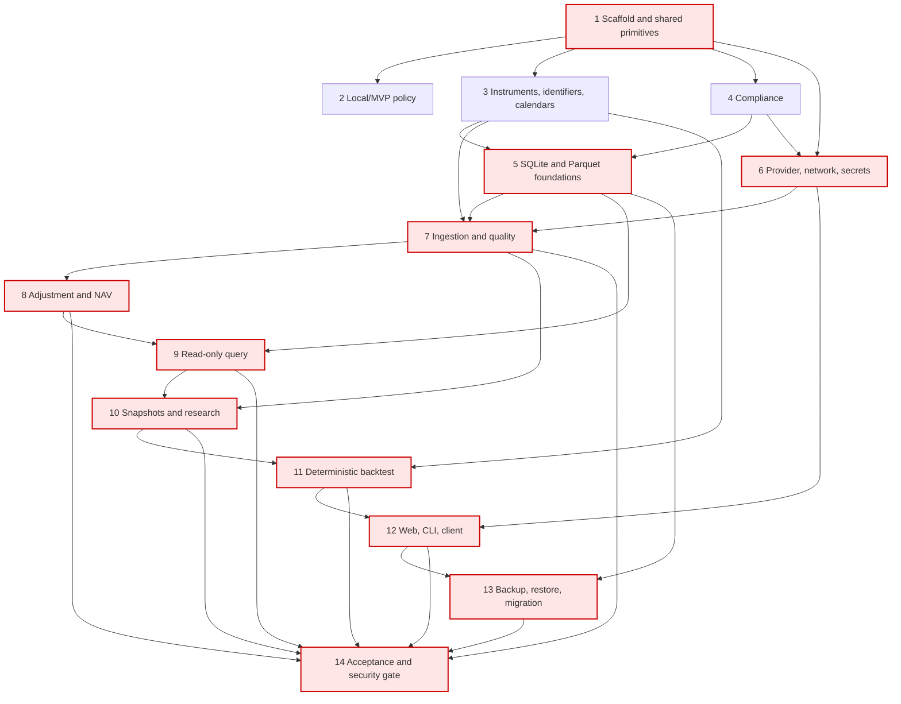

# Implementation Plan: Personal Stock & Fund Analysis Platform

## Overview

Implement the confirmed Python 3.12 modular-monolith design incrementally. Each leaf task is intended to be executable by one coding agent and states its affected modules, prerequisites, expected output, focused validation, and requirement traceability. Agents must treat `requirements.md` and `design.md` in this spec directory as the only product/design authority, preserve the strict local single-user research boundary, and avoid live trading, real-time data, multi-user architecture, distributed workers, and cloud deployment.

Parallel work is allowed only when tasks appear in the same execution wave and their listed prerequisites are complete. A task must not broaden an interface owned by another task without first updating the plan. Tests are mandatory because they establish acceptance and property coverage; no task is marked optional.

## Tasks

- [ ] 1. Scaffold the Python repository and freeze foundational interfaces
  - [x] 1.1 Create the Python 3.12 package, dependency, and tool configuration
    - **Affected modules:** `pyproject.toml`, lockfile, `src/stock_platform/__init__.py`, package directories from the design, `.gitignore`.
    - **Prerequisites:** None.
    - **Expected output / verify:** Installable `src` package with exact locked runtime/test dependencies and empty importable module boundaries; run `python -m pip install -e '.[test]'` and `python -c "import stock_platform"`.
    - _Requirements: 1.1, 1.3, 14.1_
  - [x] 1.2 Establish deterministic test infrastructure and architecture checks
    - **Affected modules:** `tests/conftest.py`, `tests/strategies/`, `tests/architecture/`, pytest/Hypothesis configuration.
    - **Prerequisites:** 1.1.
    - **Expected output / verify:** Shared Decimal/date/timezone/state strategies, fake clock/transport/keyring fixtures, temporary SQLite/object-store fixtures, minimum 100 Hypothesis examples, and dependency-direction test; run `python -m pytest tests/architecture -q`.
    - _Requirements: 1.1-1.5, 11.6-11.7, 13.1-13.3_
  - [x] 1.3 Add shared result, error, identifier, time, Decimal, and immutable DTO primitives
    - **Affected modules:** `src/stock_platform/domain/common.py`, `src/stock_platform/application/dto.py`, `src/stock_platform/application/errors.py`.
    - **Prerequisites:** 1.1.
    - **Expected output / verify:** Frozen typed values and stable error envelope with redaction-safe context, timezone-aware timestamps, canonical JSON helpers, and no infrastructure imports; run `python -m pytest tests/unit/domain/test_common.py -q`.
    - _Requirements: 2.1, 4.2, 5.9, 7.9, 10.10-10.13_

- [ ] 2. Implement local ownership and strict MVP capability boundaries
  - [x] 2.1 Implement local owner, loopback, session, CSRF, idempotency, and writer-lock guards
    - **Affected modules:** `src/stock_platform/application/access.py`, `src/stock_platform/infrastructure/locking.py`, `tests/unit/application/test_access.py`.
    - **Prerequisites:** 1.3.
    - **Expected output / verify:** Guards reject a different effective UID before transaction/network access and serialize writes without preventing same-user read sessions; run `python -m pytest tests/unit/application/test_access.py -q`.
    - _Requirements: 1.1-1.2_
  - [x] 2.2 Write Property 1 test for local owner isolation
    - **Affected modules:** `tests/property/test_property_01_local_owner_isolation.py`.
    - **Prerequisites:** 2.1, 1.2.
    - **Expected output / verify:** Hypothesis test hashes persisted state before/after allowed and denied UID attempts; run `python -m pytest tests/property/test_property_01_local_owner_isolation.py -q`.
    - **Property 1: Local owner isolation.**
    - **Validates: Requirements 1.1, 1.2**
  - [x] 2.3 Implement future-capability and market-interaction policy rejection
    - **Affected modules:** `src/stock_platform/domain/capabilities.py`, `src/stock_platform/application/policy.py`, `tests/unit/application/test_mvp_policy.py`.
    - **Prerequisites:** 1.3.
    - **Expected output / verify:** Typed rejection enumerates every requested unsupported capability and exposes no broker/order/live-trading port; run `python -m pytest tests/unit/application/test_mvp_policy.py -q`.
    - _Requirements: 1.6, 1.8, 12.16_
  - [x] 2.4 Write Property 3 test for inert unsupported MVP capabilities
    - **Affected modules:** `tests/property/test_property_03_unsupported_capabilities.py`.
    - **Prerequisites:** 2.3, 1.2.
    - **Expected output / verify:** Generated unsupported-capability subsets cause no network calls or persisted-state changes; run `python -m pytest tests/property/test_property_03_unsupported_capabilities.py -q`.
    - **Property 3: Unsupported MVP capabilities are inert.**
    - **Validates: Requirements 1.8**

- [ ] 3. Implement pure instrument, identifier, and calendar domains
  - [x] 3.1 Implement supported instrument classification and validation
    - **Affected modules:** `src/stock_platform/domain/instruments.py`, `tests/unit/domain/test_instruments.py`.
    - **Prerequisites:** 1.3.
    - **Expected output / verify:** Closed four-value instrument type and market-aware instrument values reject aliases/other types; run `python -m pytest tests/unit/domain/test_instruments.py -q`.
    - _Requirements: 2.1, 5.9_
  - [x] 3.2 Write Property 4 test for total, exclusive instrument classification
    - **Affected modules:** `tests/property/test_property_04_instrument_classification.py`.
    - **Prerequisites:** 3.1, 1.2.
    - **Expected output / verify:** Generated supported and unsupported values prove exact classification; run `python -m pytest tests/property/test_property_04_instrument_classification.py -q`.
    - **Property 4: Instrument classification is total and exclusive over the supported domain.**
    - **Validates: Requirements 2.1**
  - [x] 3.3 Implement canonical security identities, master versions, mappings, and resolver
    - **Affected modules:** `src/stock_platform/domain/identifiers.py`, `tests/unit/domain/test_identifiers.py`.
    - **Prerequisites:** 3.1.
    - **Expected output / verify:** Pure registration/version/closed-interval resolution operations produce resolved, unresolved, or ambiguous typed results and aggregate validation errors; run `python -m pytest tests/unit/domain/test_identifiers.py -q`.
    - _Requirements: 5.1-5.9_
  - [x] 3.4 Write Property 18 test for stable canonical-security bijection
    - **Affected modules:** `tests/property/test_property_18_security_bijection.py`.
    - **Prerequisites:** 3.3, 1.2.
    - **Expected output / verify:** Stateful registration and lifecycle changes preserve one-to-one identity assignment; run the file with pytest.
    - **Property 18: Canonical security assignment is a stable bijection.**
    - **Validates: Requirements 5.1, 5.2**
  - [x] 3.5 Write Property 19 test for atomic identifier writes
    - **Affected modules:** `tests/property/test_property_19_identifier_atomicity.py`.
    - **Prerequisites:** 3.3, 1.2.
    - **Expected output / verify:** Generated invalid field combinations report all violations and preserve state; run the file with pytest.
    - **Property 19: Identifier writes are valid or atomic failures.**
    - **Validates: Requirements 5.3, 5.9**
  - [x] 3.6 Write Property 20 test for mapping-resolution trichotomy
    - **Affected modules:** `tests/property/test_property_20_mapping_trichotomy.py`.
    - **Prerequisites:** 3.3, 1.2.
    - **Expected output / verify:** Arbitrary mapping sets return exactly one disjoint result with complete match details; run the file with pytest.
    - **Property 20: Security mapping resolution is a trichotomy.**
    - **Validates: Requirements 5.4-5.6**
  - [x] 3.7 Write Property 21 test for complete security history
    - **Affected modules:** `tests/property/test_property_21_security_history.py`.
    - **Prerequisites:** 3.3, 1.2.
    - **Expected output / verify:** Stateful name/status/mapping changes append versions and retain required master fields; run the file with pytest.
    - **Property 21: Security Master changes preserve complete history.**
    - **Validates: Requirements 5.7, 5.8**
  - [x] 3.8 Implement versioned trading/valuation calendars and timestamp interpretation
    - **Affected modules:** `src/stock_platform/domain/calendars.py`, `tests/unit/domain/test_calendars.py`.
    - **Prerequisites:** 1.3.
    - **Expected output / verify:** Non-overlapping effective versions, IANA timezone conversion, open/expected dates, and missing/ambiguous errors; run `python -m pytest tests/unit/domain/test_calendars.py -q`.
    - _Requirements: 6.1-6.5_
  - [x] 3.9 Write Property 22 test for valid non-overlapping calendar versions
    - **Affected modules:** `tests/property/test_property_22_calendar_versions.py`.
    - **Prerequisites:** 3.8, 1.2.
    - **Expected output / verify:** Generated intervals/types/markets prove registration constraints; run the file with pytest.
    - **Property 22: Calendar version sets are valid and non-overlapping.**
    - **Validates: Requirements 6.1, 6.2**
  - [x] 3.10 Write Property 23 test for timezone-based observation dates
    - **Affected modules:** `tests/property/test_property_23_calendar_timezone_mapping.py`.
    - **Prerequisites:** 3.8, 1.2.
    - **Expected output / verify:** UTC boundaries, DST, and effective edges map to the uniquely applicable local date; run the file with pytest.
    - **Property 23: Observation dates follow the uniquely applicable timezone.**
    - **Validates: Requirements 6.3, 6.4**
  - [x] 3.11 Write Property 24 test for atomic calendar-interpretation rejection
    - **Affected modules:** `tests/property/test_property_24_calendar_rejection.py`.
    - **Prerequisites:** 3.8, 1.2.
    - **Expected output / verify:** Zero/multiple versions identify condition and preserve dataset model state; run the file with pytest.
    - **Property 24: Non-unique calendar interpretation is rejected atomically.**
    - **Validates: Requirements 6.5**
  - [x] 3.12 Implement precedence-defined missing-observation classification
    - **Affected modules:** `src/stock_platform/domain/calendars.py`, `tests/unit/domain/test_gap_classification.py`.
    - **Prerequisites:** 3.8.
    - **Expected output / verify:** Every absent expected date receives exactly one retained reason code by the specified precedence; run the focused test file.
    - _Requirements: 6.6-6.9, 9.12_
  - [x] 3.13 Write Property 25 test for exactly one missing-observation reason
    - **Affected modules:** `tests/property/test_property_25_missing_reason.py`.
    - **Prerequisites:** 3.12, 1.2.
    - **Expected output / verify:** Generated calendar/tradability/NAV states prove exhaustive exclusive classification; run the file with pytest.
    - **Property 25: Every missing observation has exactly one precedence-defined reason.**
    - **Validates: Requirements 6.6-6.9, 9.12**

- [ ] 4. Implement compliance and export policy
  - [x] 4.1 Implement Compliance Profile validation, versioning, and decisions
    - **Affected modules:** `src/stock_platform/domain/compliance.py`, `tests/unit/domain/test_compliance.py`.
    - **Prerequisites:** 1.3.
    - **Expected output / verify:** Exact enums/lengths/purpose uniqueness/second precision/UTC offsets, append-only changes, first-request gate, and retention decisions; run focused unit tests.
    - _Requirements: 4.1-4.4, 4.8-4.9_
  - [x] 4.2 Write Property 14 test for conjunctive Compliance Profile validity
    - **Affected modules:** `tests/property/test_property_14_compliance_validation.py`.
    - **Prerequisites:** 4.1, 1.2.
    - **Expected output / verify:** Generated profiles identify exactly all invalid fields and issue no request/version on failure; run the file with pytest.
    - **Property 14: Compliance validity is conjunctive and reports all violations.**
    - **Validates: Requirements 4.2, 4.8**
  - [x] 4.3 Write Property 15 test for append-only compliance history
    - **Affected modules:** `tests/property/test_property_15_compliance_history.py`.
    - **Prerequisites:** 4.1, 1.2.
    - **Expected output / verify:** Rule-based state machine proves immutable prior versions and rejected update/delete; run the file with pytest.
    - **Property 15: Compliance history is append-only.**
    - **Validates: Requirements 4.3, 4.9**
  - [x] 4.4 Implement pinned-profile export authorization
    - **Affected modules:** `src/stock_platform/application/exports.py`, `tests/unit/application/test_exports.py`.
    - **Prerequisites:** 4.1.
    - **Expected output / verify:** Explicit export categories are allowed/denied by a referenced profile version before output creation; run focused tests.
    - _Requirements: 4.5, 4.7_
  - [x] 4.5 Write Property 16 test for pinned-profile export authorization
    - **Affected modules:** `tests/property/test_property_16_export_authorization.py`.
    - **Prerequisites:** 4.4, 1.2.
    - **Expected output / verify:** Generated category/permission combinations prove denied exports emit zero bytes and preserve state; run the file with pytest.
    - **Property 16: Export authorization follows the pinned profile version.**
    - **Validates: Requirements 4.5**
  - [x] 4.6 Implement retained-raw-response compliance provenance values
    - **Affected modules:** `src/stock_platform/domain/compliance.py`, `src/stock_platform/domain/provenance.py`, `tests/unit/domain/test_raw_provenance.py`.
    - **Prerequisites:** 4.1.
    - **Expected output / verify:** Raw retention record requires provider, parameters, profile version, and legal second-precision request time; run focused tests.
    - _Requirements: 4.6_
  - [x] 4.7 Write Property 17 test for complete raw-data compliance provenance
    - **Affected modules:** `tests/property/test_property_17_raw_provenance.py`.
    - **Prerequisites:** 4.6, 1.2.
    - **Expected output / verify:** Arbitrary retained responses cannot be constructed without complete provenance; run the file with pytest.
    - **Property 17: Retained raw data has complete compliance provenance.**
    - **Validates: Requirements 4.6**

- [ ] 5. Build the SQLite control plane and immutable Parquet data plane
  - [x] 5.1 Define SQLAlchemy models, constraints, append-only triggers, and initial Alembic schema
    - **Affected modules:** `src/stock_platform/infrastructure/sqlite/models.py`, `repositories.py`, `migrations/versions/`, schema tests.
    - **Prerequisites:** 1.3, 3.3, 3.8, 4.1.
    - **Expected output / verify:** Design-listed control tables, unique/foreign-key/interval/current-observation constraints, legal state transitions, and no secret columns; run `python -m alembic upgrade head` against a temporary DB and schema tests.
    - _Requirements: 2.8, 4.3, 4.9, 5.1-5.8, 6.1-6.2, 7.2-7.4, 11.1-11.3_
  - [x] 5.2 Implement typed repositories and SQLite Unit of Work
    - **Affected modules:** `src/stock_platform/infrastructure/sqlite/repositories.py`, `unit_of_work.py`, repository integration tests.
    - **Prerequisites:** 5.1.
    - **Expected output / verify:** Repository APIs expose insert/read and explicit legal state transitions only; rollback leaves pre-state unchanged; run focused integration tests.
    - _Requirements: 2.8, 4.3, 4.9, 5.1-5.9, 7.2-7.3, 11.1_
  - [x] 5.3 Implement content-addressed immutable Parquet object storage
    - **Affected modules:** `src/stock_platform/infrastructure/parquet/schemas.py`, `object_store.py`, `tests/integration/parquet/`.
    - **Prerequisites:** 1.3.
    - **Expected output / verify:** `daily_bar.v1`/`fund_nav.v1` schemas, Decimal preservation, temp-write/fsync/schema-row-hash verification, atomic SHA-256 publish, and immutable reads; run focused integration tests.
    - _Requirements: 1.3, 2.8, 7.2-7.4, 8.1_
  - [x] 5.4 Implement atomic dataset publication across Parquet and SQLite
    - **Affected modules:** `src/stock_platform/infrastructure/parquet/publisher.py`, `src/stock_platform/application/publication.py`, fault-injection tests.
    - **Prerequisites:** 5.2, 5.3.
    - **Expected output / verify:** Files publish before one SQLite reference transaction; failures expose no half-published dataset and leave only safely reclaimable unreferenced objects; run fault-injection tests.
    - _Requirements: 2.6, 2.8, 7.2-7.3, 7.6_
  - [x] 5.5 Validate control/data-plane constraints and immutable publication checkpoint
    - **Affected modules:** `tests/integration/storage/test_control_data_plane.py`.
    - **Prerequisites:** 5.4.
    - **Expected output / verify:** Automated test covers append-only enforcement, duplicate keys, transaction rollback, Parquet checksums, and SQLite/Parquet reference consistency; run `python -m pytest tests/integration/storage -q`.
    - _Requirements: 2.8, 4.9, 5.2, 7.2-7.3, 8.1_

- [ ] 6. Implement provider, network, credential, and secret boundaries
  - [x] 6.1 Define and load the versioned Provider Adapter contract
    - **Affected modules:** `src/stock_platform/providers/contract.py`, `registry.py`, `tests/unit/providers/test_contract.py`.
    - **Prerequisites:** 1.3, 3.1.
    - **Expected output / verify:** Entry-point discovery, singular declared version, required members, compatibility state, explicit allowlist, and no repository/network bypass; run focused tests.
    - _Requirements: 3.1-3.2, 3.7_
  - [x] 6.2 Write Property 9 test for singular implemented adapter contracts
    - **Affected modules:** `tests/property/test_property_09_adapter_contract.py`.
    - **Prerequisites:** 6.1, 1.2.
    - **Expected output / verify:** Generated malformed adapter shapes load only when one declared contract is fully implemented; run the file with pytest.
    - **Property 9: Adapter contract declaration is singular and implemented.**
    - **Validates: Requirements 3.1**
  - [x] 6.3 Implement capability reporting and replacement-adapter state transition
    - **Affected modules:** `src/stock_platform/providers/capabilities.py`, `src/stock_platform/application/providers.py`, unit tests.
    - **Prerequisites:** 6.1.
    - **Expected output / verify:** Known values pass unchanged, unknown is explicit, and replacement enables atomically only after contract/capability/probe success; run focused tests.
    - _Requirements: 2.5, 3.3, 3.8_
  - [x] 6.4 Write Property 10 test for known/unknown capability reporting
    - **Affected modules:** `tests/property/test_property_10_capability_reporting.py`.
    - **Prerequisites:** 6.3, 1.2.
    - **Expected output / verify:** All reported/unreported field combinations preserve exact semantics; run the file with pytest.
    - **Property 10: Capability reporting preserves known and unknown values.**
    - **Validates: Requirements 3.3**
  - [x] 6.5 Implement provider envelopes, provenance propagation, and categorized errors
    - **Affected modules:** `src/stock_platform/providers/contract.py`, `src/stock_platform/domain/provenance.py`, `src/stock_platform/providers/errors.py`, unit tests.
    - **Prerequisites:** 6.1, 4.6.
    - **Expected output / verify:** Provider IDs/source version/retrieval time remain associated through normalization; rate-limit/unavailable errors carry safe required context; run focused tests.
    - _Requirements: 2.7, 3.4-3.6, 7.4_
  - [x] 6.6 Write Property 11 test for normalization provenance preservation
    - **Affected modules:** `tests/property/test_property_11_provider_provenance.py`.
    - **Prerequisites:** 6.5, 1.2.
    - **Expected output / verify:** Generated envelopes preserve every required provenance value through a normalized row; run the file with pytest.
    - **Property 11: Provider provenance survives normalization.**
    - **Validates: Requirements 3.4, 7.4**
  - [x] 6.7 Write Property 12 test for complete rate-limit translation
    - **Affected modules:** `tests/property/test_property_12_rate_limit_translation.py`.
    - **Prerequisites:** 6.5, 1.2.
    - **Expected output / verify:** Generated throttling responses include provider/category/retry eligibility and conditional correlation ID; run the file with pytest.
    - **Property 12: Rate-limit translation is complete.**
    - **Validates: Requirements 3.5, 3.6**
  - [x] 6.8 Write Property 13 test for incompatible-adapter request prevention
    - **Affected modules:** `tests/property/test_property_13_adapter_compatibility.py`.
    - **Prerequisites:** 6.3, 1.2.
    - **Expected output / verify:** Generated version pairs prove incompatible adapters stay disabled with zero requests and both versions reported; run the file with pytest.
    - **Property 13: Incompatible adapters cannot issue requests.**
    - **Validates: Requirements 3.7**
  - [x] 6.9 Implement the endpoint-confined HTTPX Network Gateway
    - **Affected modules:** `src/stock_platform/infrastructure/network/gateway.py`, `endpoint_policy.py`, fake-transport tests.
    - **Prerequisites:** 6.1, 1.3.
    - **Expected output / verify:** HTTPS origin/base-path normalization, DNS/IP policy, no automatic redirects, every-hop validation, cross-origin stripping, and no transmit before validation; run focused tests without public network.
    - _Requirements: 1.4-1.5, 13.7_
  - [x] 6.10 Write Property 2 test for configured endpoint confinement
    - **Affected modules:** `tests/property/test_property_02_endpoint_confinement.py`.
    - **Prerequisites:** 6.9, 1.2.
    - **Expected output / verify:** Generated URLs/redirect chains prove only configured hops transmit and blocked targets preserve state; run the file with pytest.
    - **Property 2: Configured endpoint confinement.**
    - **Validates: Requirements 1.4, 1.5, 13.7**
  - [x] 6.11 Implement Keychain credential references, selective deletion, and recursive Secret Redactor
    - **Affected modules:** `src/stock_platform/infrastructure/secrets/keychain.py`, `redaction.py`, `src/stock_platform/application/credentials.py`, unit tests.
    - **Prerequisites:** 1.3.
    - **Expected output / verify:** No plaintext project/DB storage, minimal-scope reads, fixed marker for raw/URL/base64/auth variants, separately selectable deletions, and no-request unavailable result; run focused fake-keyring tests.
    - _Requirements: 13.1-13.6, 13.8_
  - [x] 6.12 Write Property 60 test for secret-free observable/persisted sinks
    - **Affected modules:** `tests/property/test_property_60_secret_redaction.py`.
    - **Prerequisites:** 6.11, 1.2.
    - **Expected output / verify:** Generated secrets/encodings/nested values never survive sink redaction; run the file with pytest.
    - **Property 60: Secrets never reach observable or persisted sinks.**
    - **Validates: Requirements 13.3, 13.8**
  - [x] 6.13 Write Property 61 test for exact selective credential deletion
    - **Affected modules:** `tests/property/test_property_61_credential_deletion.py`.
    - **Prerequisites:** 6.11, 1.2.
    - **Expected output / verify:** Arbitrary credential sets/subsets delete exactly selections; run the file with pytest.
    - **Property 61: Credential deletion is exactly selective.**
    - **Validates: Requirements 13.5**
  - [x] 6.14 Write Property 62 test for unavailable-credential request prevention
    - **Affected modules:** `tests/property/test_property_62_credential_unavailable.py`.
    - **Prerequisites:** 6.11, 6.9, 1.2.
    - **Expected output / verify:** Absent/inaccessible credentials produce zero transport calls and secret-free errors; run the file with pytest.
    - **Property 62: Unavailable credentials prevent requests.**
    - **Validates: Requirements 13.6**
  - [x] 6.15 Build the reusable Provider Adapter contract/integration suite
    - **Affected modules:** `tests/contracts/providers/`, `tests/integration/network/`.
    - **Prerequisites:** 6.3, 6.5, 6.9, 6.11, 4.1.
    - **Expected output / verify:** Fake reference adapter covers auth, first-request compliance, capabilities, provenance, missing fields, unavailable/rate-limit, correlation ID, redirects, and failed replacement rollback; run `python -m pytest tests/contracts/providers tests/integration/network -q`.
    - _Requirements: 2.5, 2.7, 3.1-3.8, 4.1, 13.1-13.8_

- [ ] 7. Implement ingestion, observation versioning, and data quality
  - [x] 7.1 Implement Daily Bar and Fund NAV candidate normalization
    - **Affected modules:** `src/stock_platform/domain/ingestion.py`, `normalization.py`, unit tests.
    - **Prerequisites:** 3.1, 3.8, 6.5.
    - **Expected output / verify:** Decimal parsing, required-field aggregation, calendar/numeric/OHLC/NAV atomic validation, and typed accepted/rejected candidates; run focused unit tests.
    - _Requirements: 2.2-2.4, 2.6, 7.7, 9.2-9.7_
  - [x] 7.2 Write Property 5 test for Daily Bar acceptance equivalence
    - **Affected modules:** `tests/property/test_property_05_daily_bar_acceptance.py`.
    - **Prerequisites:** 7.1, 1.2.
    - **Expected output / verify:** Generated bars/calendars prove iff acceptance, all failures reported, prior facts unchanged; run the file with pytest.
    - **Property 5: Daily Bar acceptance is equivalent to all canonical constraints.**
    - **Validates: Requirements 2.2, 2.6, 7.7, 9.2-9.7**
  - [x] 7.3 Write Property 6 test for Fund NAV acceptance equivalence
    - **Affected modules:** `tests/property/test_property_06_fund_nav_acceptance.py`.
    - **Prerequisites:** 7.1, 1.2.
    - **Expected output / verify:** Generated NAV rows/calendars prove iff acceptance and cumulative NAV rules; run the file with pytest.
    - **Property 6: Fund NAV acceptance is equivalent to all canonical constraints.**
    - **Validates: Requirements 2.3, 2.4, 2.6, 7.7, 9.5, 9.7**
  - [x] 7.4 Implement unsupported-coverage decision at ingestion boundary
    - **Affected modules:** `src/stock_platform/application/ingestion.py`, `tests/unit/application/test_ingestion_coverage.py`.
    - **Prerequisites:** 6.3, 3.1.
    - **Expected output / verify:** Missing market/type support returns exact pair without selecting/publishing a new dataset; run focused tests.
    - _Requirements: 2.5_
  - [x] 7.5 Write Property 7 test for non-mutating unsupported coverage
    - **Affected modules:** `tests/property/test_property_07_unsupported_coverage.py`.
    - **Prerequisites:** 7.4, 1.2.
    - **Expected output / verify:** Generated capabilities and requests preserve dataset hash on unsupported pairs; run the file with pytest.
    - **Property 7: Unsupported coverage is non-mutating.**
    - **Validates: Requirements 2.5**
  - [x] 7.6 Implement non-refresh, refresh, invalid-range, and storage-preflight planning
    - **Affected modules:** `src/stock_platform/domain/ingestion.py`, `src/stock_platform/application/ingestion_preflight.py`, unit tests.
    - **Prerequisites:** 3.8, 4.1, 6.3.
    - **Expected output / verify:** Maximal expected-minus-existing segments, full refresh dates, boundary validation before network, compliance/credential/space checks; run focused tests.
    - _Requirements: 7.1, 7.8-7.9, 14.6_
  - [x] 7.7 Write Property 26 test for maximal missing ingestion segments
    - **Affected modules:** `tests/property/test_property_26_missing_segments.py`.
    - **Prerequisites:** 7.6, 1.2.
    - **Expected output / verify:** Generated expected/existing dates expand exactly and cannot be merged further; run the file with pytest.
    - **Property 26: Non-refresh ingestion requests maximal missing segments.**
    - **Validates: Requirements 7.1**
  - [x] 7.8 Write Property 29 test for refresh planning
    - **Affected modules:** `tests/property/test_property_29_refresh_planning.py`.
    - **Prerequisites:** 7.6, 1.2.
    - **Expected output / verify:** Refresh always returns all expected dates regardless of stored observations; run the file with pytest.
    - **Property 29: Refresh planning ignores existing observations.**
    - **Validates: Requirements 7.8**
  - [x] 7.9 Write Property 30 test for pre-network invalid-range failure
    - **Affected modules:** `tests/property/test_property_30_invalid_ranges.py`.
    - **Prerequisites:** 7.6, 1.2.
    - **Expected output / verify:** Omitted/malformed/inverted ranges cause zero calls and preserve dataset; run the file with pytest.
    - **Property 30: Invalid ranges fail before network access.**
    - **Validates: Requirements 7.9**
  - [x] 7.10 Implement logical observation comparison and linear version decisions
    - **Affected modules:** `src/stock_platform/domain/ingestion.py`, `tests/unit/domain/test_observation_versioning.py`.
    - **Prerequisites:** 7.1.
    - **Expected output / verify:** Canonical value hash excludes retrieval time; equal values reuse IDs and changed values point to immediate predecessor; run focused tests.
    - _Requirements: 7.2-7.3_
  - [x] 7.11 Write Property 27 test for idempotent linear observation versioning
    - **Affected modules:** `tests/property/test_property_27_observation_versioning.py`.
    - **Prerequisites:** 7.10, 1.2.
    - **Expected output / verify:** Stateful generated observation sequences prove reuse/one-version append/history retention; run the file with pytest.
    - **Property 27: Observation versioning is idempotent and linear.**
    - **Validates: Requirements 7.2, 7.3**
  - [x] 7.12 Implement versioned Data Quality rules, assessments, issues, and reports
    - **Affected modules:** `src/stock_platform/domain/quality.py`, `tests/unit/domain/test_quality.py`.
    - **Prerequisites:** 7.1, 3.12.
    - **Expected output / verify:** Uniqueness/required/OHLC/value/calendar rules, complete evidence, missing dependencies, severity max, report aggregation, and quality re-evaluation; run focused tests.
    - _Requirements: 9.1-9.10, 9.13_
  - [x] 7.13 Write Property 8 test for unique current canonical observations
    - **Affected modules:** `tests/property/test_property_08_observation_uniqueness.py`.
    - **Prerequisites:** 7.10, 7.12, 1.2.
    - **Expected output / verify:** Arbitrary publication sequences retain one current logical key and flag duplicates; run the file with pytest.
    - **Property 8: Current canonical observations are unique.**
    - **Validates: Requirements 2.8, 9.1**
  - [x] 7.14 Write Property 38 test for complete quality evidence
    - **Affected modules:** `tests/property/test_property_38_quality_evidence.py`.
    - **Prerequisites:** 7.12, 1.2.
    - **Expected output / verify:** Every generated failed rule records all mandatory evidence; run the file with pytest.
    - **Property 38: Quality issues contain complete evidence.**
    - **Validates: Requirements 9.8**
  - [x] 7.15 Write Property 39 test for maximum quality severity
    - **Affected modules:** `tests/property/test_property_39_quality_severity.py`.
    - **Prerequisites:** 7.12, 1.2.
    - **Expected output / verify:** Generated rule outcomes/dependency failures select exact version-defined maximum and name missing inputs; run the file with pytest.
    - **Property 39: Quality severity is the maximum applicable severity.**
    - **Validates: Requirements 9.9, 9.10**
  - [x] 7.16 Write Property 40 test for complete quality-report aggregation
    - **Affected modules:** `tests/property/test_property_40_quality_report.py`.
    - **Prerequisites:** 7.12, 1.2.
    - **Expected output / verify:** Generated checks aggregate exactly scope/version/issues/status/time; run the file with pytest.
    - **Property 40: Quality reports are complete aggregations.**
    - **Validates: Requirements 9.13**
  - [x] 7.17 Implement resumable ingestion orchestration and conserved run accounting
    - **Affected modules:** `src/stock_platform/application/ingestion.py`, provider/repository/publisher ports, integration tests.
    - **Prerequisites:** 5.4, 6.15, 7.4, 7.6, 7.10, 7.12.
    - **Expected output / verify:** Preflight-to-fetch-to-normalize-to-quality-to-publish flow, ephemeral retention branch, mutually exclusive counts, partial finalized commits, provider failure boundary, and resume idempotency; run focused integration tests.
    - _Requirements: 2.2-2.8, 4.1, 4.4, 6.5, 7.1-7.10, 9.13, 14.6_
  - [x] 7.18 Write Property 28 test for exclusive conserved ingestion counts
    - **Affected modules:** `tests/property/test_property_28_ingestion_counts.py`.
    - **Prerequisites:** 7.17, 1.2.
    - **Expected output / verify:** Generated outcomes belong to one category and sum to requested; run the file with pytest.
    - **Property 28: Ingestion outcome counts are exclusive and conserved.**
    - **Validates: Requirements 7.5**
  - [x] 7.19 Write Property 31 test for resume finalized-date complement
    - **Affected modules:** `tests/property/test_property_31_ingestion_resume.py`.
    - **Prerequisites:** 7.17, 1.2.
    - **Expected output / verify:** Stateful interruptions request exactly unfinalized dates from boundary and preserve finalized IDs; run the file with pytest.
    - **Property 31: Resume planning is the finalized-date complement.**
    - **Validates: Requirements 7.10**
  - [x] 7.20 Write Property 64 test for exact storage preflight
    - **Affected modules:** `tests/property/test_property_64_storage_preflight.py`.
    - **Prerequisites:** 7.6, 1.2.
    - **Expected output / verify:** Generated non-negative byte counts proceed iff available >= estimated and otherwise issue no request; run the file with pytest.
    - **Property 64: Storage preflight is exact.**
    - **Validates: Requirements 14.6**
  - [x] 7.21 Validate ingestion failure, resume, compliance, and publication integration
    - **Affected modules:** `tests/integration/ingestion/`.
    - **Prerequisites:** 7.17, 7.18, 7.19, 7.20.
    - **Expected output / verify:** Fake-provider tests cover unavailable/rate-limit, retention prohibited, missing fields, changed/unchanged rows, interruption at every commit point, and resume; run `python -m pytest tests/integration/ingestion -q`.
    - _Requirements: 2.2-2.8, 4.1, 4.4, 7.1-7.10, 9.1-9.13, 14.6_

- [ ] 8. Implement price adjustment and fund NAV presentation semantics
  - [x] 8.1 Implement versioned factors and Adjustment Service
    - **Affected modules:** `src/stock_platform/domain/adjustments.py`, unit tests.
    - **Prerequisites:** 7.10, 7.12.
    - **Expected output / verify:** Immutable raw prices, required mode, identity/unified factor formulas, fixed full-series anchors, positive complete factors, source/version metadata, and all-or-nothing adjusted series; run focused tests.
    - _Requirements: 8.1-8.9_
  - [x] 8.2 Write Property 32 test for raw-price immutability
    - **Affected modules:** `tests/property/test_property_32_raw_price_immutability.py`.
    - **Prerequisites:** 8.1, 1.2.
    - **Expected output / verify:** Generated modes/factor updates never alter raw values; run the file with pytest.
    - **Property 32: Raw prices are immutable under adjustment operations.**
    - **Validates: Requirements 8.1**
  - [x] 8.3 Write Property 33 test for exactly one valid adjustment mode
    - **Affected modules:** `tests/property/test_property_33_adjustment_mode.py`.
    - **Prerequisites:** 8.1, 1.2.
    - **Expected output / verify:** Missing/multiple/invalid modes return no series and list all valid modes; run the file with pytest.
    - **Property 33: Price requests require exactly one valid adjustment mode.**
    - **Validates: Requirements 8.2, 8.3**
  - [x] 8.4 Write Property 34 test for unadjusted identity
    - **Affected modules:** `tests/property/test_property_34_unadjusted_identity.py`.
    - **Prerequisites:** 8.1, 1.2.
    - **Expected output / verify:** Arbitrary raw series preserve values and ordering; run the file with pytest.
    - **Property 34: Unadjusted prices are an identity transformation.**
    - **Validates: Requirements 8.4**
  - [x] 8.5 Write Property 35 test for one complete positive factor version
    - **Affected modules:** `tests/property/test_property_35_adjusted_factor_series.py`.
    - **Prerequisites:** 8.1, 1.2.
    - **Expected output / verify:** Generated complete factors match anchor oracle; missing/nonpositive factors reject entire output and quality; run the file with pytest.
    - **Property 35: Adjusted prices use one complete positive factor version.**
    - **Validates: Requirements 8.5, 8.7, 8.8**
  - [x] 8.6 Write Property 36 test for exclusive complete factor provenance
    - **Affected modules:** `tests/property/test_property_36_factor_provenance.py`.
    - **Prerequisites:** 8.1, 1.2.
    - **Expected output / verify:** Factors require exactly one provider/corporate-action source plus date/time/version; run the file with pytest.
    - **Property 36: Adjustment factor provenance is exclusive and complete.**
    - **Validates: Requirements 8.6**
  - [x] 8.7 Implement provider-only open-end-fund cumulative NAV response
    - **Affected modules:** `src/stock_platform/domain/adjustments.py`, `tests/unit/domain/test_fund_nav_response.py`.
    - **Prerequisites:** 7.1.
    - **Expected output / verify:** Provider cumulative NAV is never synthesized; absence returns unchanged unit NAV plus explicit unavailable status; run `python -m pytest tests/unit/domain/test_fund_nav_response.py -q`.
    - _Requirements: 8.10-8.11_
  - [x] 8.8 Write Property 37 test for provider-only cumulative NAV with explicit fallback
    - **Affected modules:** `tests/property/test_property_37_fund_nav_fallback.py`.
    - **Prerequisites:** 8.7, 1.2.
    - **Expected output / verify:** Generated NAV observations return cumulative NAV iff provider-supplied and otherwise preserve unit NAV plus unavailable status; run the file with pytest.
    - **Property 37: Open-end fund cumulative NAV is provider-only with explicit fallback.**
    - **Validates: Requirements 8.10, 8.11**
  - [x] 8.9 Validate adjustment labels, subrange consistency, and rejected-factor integration
    - **Affected modules:** `tests/integration/adjustments/test_adjustment_service.py`.
    - **Prerequisites:** 8.2-8.8.
    - **Expected output / verify:** Persisted/query results disclose mode/source/version, subrange equals full-series slice, and invalid factors return no values; run focused integration tests.
    - _Requirements: 8.1-8.11_

- [ ] 9. Implement read-only querying and analytics
  - [x] 9.1 Implement whitelist-only DuckDB/Arrow Research Query Service
    - **Affected modules:** `src/stock_platform/infrastructure/query/service.py`, `catalog.py`, `src/stock_platform/application/queries.py`, integration tests.
    - **Prerequisites:** 5.4, 7.12, 8.1.
    - **Expected output / verify:** Snapshot-pinned entities/typed filters/stable sort, no arbitrary SQL/path/write access, <=20 filters, <=10,000 rows via 10,001 probe, and complete metadata; run focused tests.
    - _Requirements: 10.7-10.9, 10.13_
  - [x] 9.2 Write Property 46 test for read-only research queries
    - **Affected modules:** `tests/property/test_property_46_query_read_only.py`.
    - **Prerequisites:** 9.1, 1.2.
    - **Expected output / verify:** Generated valid queries preserve all control/data-plane hashes; run the file with pytest.
    - **Property 46: Research queries are read-only.**
    - **Validates: Requirements 10.7**
  - [x] 9.3 Write Property 47 test for exact query limits and metadata
    - **Affected modules:** `tests/property/test_property_47_query_limits.py`.
    - **Prerequisites:** 9.1, 1.2.
    - **Expected output / verify:** Generated queries prove filter/row limits, counts/parameters/snapshot metadata, exact `has_more`, and prior-result preservation; run the file with pytest.
    - **Property 47: Query limits and result metadata are exact.**
    - **Validates: Requirements 10.8, 10.9, 10.13**
  - [x] 9.4 Implement pure analytics results for returns, volatility, drawdown, moving average, and correlation
    - **Affected modules:** `src/stock_platform/domain/analytics.py`, `tests/unit/domain/test_analytics.py`.
    - **Prerequisites:** 1.3.
    - **Expected output / verify:** Exact documented formulas, missing/date alignment conventions, typed insufficient/invalid/undefined results, and display metadata; run focused tests.
    - _Requirements: 10.2-10.6, 10.10-10.12_
  - [x] 9.5 Write Property 41 test for consecutive non-missing periodic returns
    - **Affected modules:** `tests/property/test_property_41_periodic_returns.py`.
    - **Prerequisites:** 9.4, 1.2.
    - **Expected output / verify:** Generated dated numeric/missing series match an independent oracle; run the file with pytest.
    - **Property 41: Periodic returns follow consecutive non-missing observations.**
    - **Validates: Requirements 10.2**
  - [x] 9.6 Write Property 42 test for annualized sample volatility
    - **Affected modules:** `tests/property/test_property_42_volatility.py`.
    - **Prerequisites:** 9.4, 1.2.
    - **Expected output / verify:** Generated returns match the `n-1` and sqrt(252) oracle/tolerance; run the file with pytest.
    - **Property 42: Annualized volatility matches the stated sample formula.**
    - **Validates: Requirements 10.3**
  - [x] 9.7 Write Property 43 test for running-maximum drawdown
    - **Affected modules:** `tests/property/test_property_43_drawdown.py`.
    - **Prerequisites:** 9.4, 1.2.
    - **Expected output / verify:** Generated positive/missing series match pointwise and maximum drawdown oracle; run the file with pytest.
    - **Property 43: Drawdown follows the running maximum.**
    - **Validates: Requirements 10.4**
  - [x] 9.8 Write Property 44 test for moving averages over exactly w non-missing values
    - **Affected modules:** `tests/property/test_property_44_moving_average.py`.
    - **Prerequisites:** 9.4, 1.2.
    - **Expected output / verify:** Generated windows/series prove missing prefix and exact arithmetic mean; run the file with pytest.
    - **Property 44: Moving averages use exactly w non-missing observations.**
    - **Validates: Requirements 10.5**
  - [x] 9.9 Write Property 45 test for aligned Pearson correlation and zero variance
    - **Affected modules:** `tests/property/test_property_45_correlation.py`.
    - **Prerequisites:** 9.4, 1.2.
    - **Expected output / verify:** Generated dated series match independent aligned oracle and identify all zero-variance inputs; run the file with pytest.
    - **Property 45: Correlation uses only aligned shared dates and rejects zero variance.**
    - **Validates: Requirements 10.6, 10.11**
  - [x] 9.10 Write Property 48 test for invalid analysis input state preservation
    - **Affected modules:** `tests/property/test_property_48_invalid_analysis.py`.
    - **Prerequisites:** 9.4, 1.2.
    - **Expected output / verify:** Generated insufficient inputs/invalid windows return exact limits/counts and preserve prior result; run the file with pytest.
    - **Property 48: Invalid analysis inputs preserve the previous result.**
    - **Validates: Requirements 10.10, 10.12**

- [ ] 10. Implement immutable snapshots, manifests, research runs, and replay
  - [x] 10.1 Implement canonical Data Snapshot and Research Manifest construction
    - **Affected modules:** `src/stock_platform/domain/research.py`, `src/stock_platform/application/snapshots.py`, unit tests.
    - **Prerequisites:** 5.4, 7.12, 8.1.
    - **Expected output / verify:** Canonical sorted JSON, content-bound snapshot ID, every glossary manifest field, pinned versions/artifacts, rejected-data confirmation bound to snapshot; run focused tests.
    - _Requirements: 9.11, 11.2-11.3_
  - [x] 10.2 Write Property 49 test for complete manifests and content-bound snapshots
    - **Affected modules:** `tests/property/test_property_49_manifest_completeness.py`.
    - **Prerequisites:** 10.1, 1.2.
    - **Expected output / verify:** Generated snapshots/runs contain all fields and deterministic digest; run the file with pytest.
    - **Property 49: Research manifests are complete and snapshots content-bound.**
    - **Validates: Requirements 11.2, 11.3**
  - [x] 10.3 Implement manifest-before-result Research Runner publication
    - **Affected modules:** `src/stock_platform/application/research_runner.py`, repository/object-store ports, fault-injection tests.
    - **Prerequisites:** 10.1, 5.4.
    - **Expected output / verify:** Runner commits exactly one manifest before invoking/publishing analysis results and never publishes orphan results; run focused fault tests.
    - _Requirements: 11.1_
  - [x] 10.4 Implement pinned-artifact replay and manifest diffing
    - **Affected modules:** `src/stock_platform/application/replay.py`, `src/stock_platform/domain/research.py`, unit tests.
    - **Prerequisites:** 10.3, 9.4.
    - **Expected output / verify:** No `latest` resolution, complete missing-artifact collection, deterministic replay comparison, and exact differing-field values; run focused tests.
    - _Requirements: 11.4-11.8_
  - [x] 10.5 Write Property 50 test for pinned replay and complete absence failure
    - **Affected modules:** `tests/property/test_property_50_replay_artifacts.py`.
    - **Prerequisites:** 10.4, 1.2.
    - **Expected output / verify:** Generated availability sets resolve only pinned artifacts or publish nothing and list exact missing set; run the file with pytest.
    - **Property 50: Replay uses only pinned artifacts and fails completely on absence.**
    - **Validates: Requirements 11.4, 11.5**
  - [x] 10.6 Write Property 51 test for deterministic replay equivalence
    - **Affected modules:** `tests/property/test_property_51_replay_equivalence.py`.
    - **Prerequisites:** 10.4, 1.2.
    - **Expected output / verify:** Generated discrete/floating outputs meet exact and `1e-10 * max(1, abs(original))` comparisons; run the file with pytest.
    - **Property 51: Deterministic replay is equivalent within the specified numeric tolerance.**
    - **Validates: Requirements 11.6, 11.7**
  - [x] 10.7 Write Property 52 test for exact manifest differences
    - **Affected modules:** `tests/property/test_property_52_manifest_diff.py`.
    - **Prerequisites:** 10.4, 1.2.
    - **Expected output / verify:** Generated manifest pairs return exactly actual differing paths and both values; run the file with pytest.
    - **Property 52: Manifest difference reports are exact.**
    - **Validates: Requirements 11.8**
  - [x] 10.8 Validate rejected-snapshot confirmation and research publication/replay integration
    - **Affected modules:** `tests/integration/research/`.
    - **Prerequisites:** 10.2-10.7, 9.1.
    - **Expected output / verify:** Tests cover confirmation gate, manifest-before-result crash points, immutable outputs, missing artifacts, deterministic replay, and diff; run `python -m pytest tests/integration/research -q`.
    - _Requirements: 9.11, 11.1-11.8_

- [ ] 11. Implement deterministic long-only daily backtesting
  - [x] 11.1 Implement Strategy Protocol, as-of Market View, capability preflight, and next-open scheduling
    - **Affected modules:** `src/stock_platform/domain/backtest.py`, `strategy.py`, unit tests.
    - **Prerequisites:** 3.8, 9.1, 10.1, 2.3.
    - **Expected output / verify:** Strategy sees daily data only through close date, unsupported capabilities reject whole run before execution, and signals schedule strictly next pinned-calendar open session; run focused tests.
    - _Requirements: 12.2-12.4, 12.16_
  - [x] 11.2 Write Property 54 test for no future/non-daily strategy data
    - **Affected modules:** `tests/property/test_property_54_no_lookahead.py`.
    - **Prerequisites:** 11.1, 1.2.
    - **Expected output / verify:** Generated calendars/frequencies/signal dates prove visibility and earliest execution boundaries; run the file with pytest.
    - **Property 54: Signals cannot use future or non-daily data.**
    - **Validates: Requirements 12.2-12.4**
  - [x] 11.3 Write Property 59 test for zero-trade unsupported strategies
    - **Affected modules:** `tests/property/test_property_59_unsupported_strategy.py`.
    - **Prerequisites:** 11.1, 1.2.
    - **Expected output / verify:** Every nonempty unsupported subset returns all capabilities, zero trades, and unchanged initial ledger; run the file with pytest.
    - **Property 59: Unsupported strategy requests execute nothing.**
    - **Validates: Requirements 12.16**
  - [x] 11.4 Implement Decimal Cost Model, execution simulator, and long-only ledger
    - **Affected modules:** `src/stock_platform/domain/backtest.py`, `execution.py`, `ledger.py`, unit tests.
    - **Prerequisites:** 11.1.
    - **Expected output / verify:** Stable execution order, slippage/gross/commission/tax/total/net cash records, currency rounding, tradability-first zero fills, cash/holding constraints; run focused tests.
    - _Requirements: 12.1, 12.5-12.8_
  - [x] 11.5 Write Property 53 test for solvent long-only ledgers
    - **Affected modules:** `tests/property/test_property_53_ledger_solvent.py`.
    - **Prerequisites:** 11.4, 1.2.
    - **Expected output / verify:** Stateful generated events preserve non-negative cash and every position after each step; run the file with pytest.
    - **Property 53: Backtest ledgers remain long-only and solvent.**
    - **Validates: Requirements 12.1**
  - [x] 11.6 Write Property 55 test for filled-trade/cost/ledger reconciliation
    - **Affected modules:** `tests/property/test_property_55_trade_reconciliation.py`.
    - **Prerequisites:** 11.4, 1.2.
    - **Expected output / verify:** Generated fills recompute every component and exact ledger delta under pinned rounding; run the file with pytest.
    - **Property 55: Filled-trade records reconcile with the cost model and ledger.**
    - **Validates: Requirements 12.5, 12.6**
  - [x] 11.7 Write Property 56 test for atomic blocked zero fills
    - **Affected modules:** `tests/property/test_property_56_blocked_trades.py`.
    - **Prerequisites:** 11.4, 1.2.
    - **Expected output / verify:** Generated tradability/insufficient-cash requests record exact reason with no ledger mutation; run the file with pytest.
    - **Property 56: Blocked trades are zero-fill atomic operations.**
    - **Validates: Requirements 12.7, 12.8**
  - [x] 11.8 Implement valuation with exactly two missing-price policies
    - **Affected modules:** `src/stock_platform/domain/valuation.py`, unit tests.
    - **Prerequisites:** 11.4, 3.8.
    - **Expected output / verify:** Unavailable and prior-valid-close-within-five-open-sessions policies produce complete audit records and dependent availability; run focused tests.
    - _Requirements: 12.9-12.10_
  - [x] 11.9 Write Property 57 test for exhaustive bounded missing-price policies
    - **Affected modules:** `tests/property/test_property_57_missing_price.py`.
    - **Prerequisites:** 11.8, 1.2.
    - **Expected output / verify:** Generated calendars/history prove exact 0/1/5/6-session boundary and audit fields; run the file with pytest.
    - **Property 57: Missing-price policies are exhaustive and bounded.**
    - **Validates: Requirements 12.9, 12.10**
  - [x] 11.10 Implement Backtest Runner and four-section report builder
    - **Affected modules:** `src/stock_platform/application/backtests.py`, `src/stock_platform/domain/backtest_report.py`, integration tests.
    - **Prerequisites:** 11.4, 11.8, 10.3.
    - **Expected output / verify:** Deterministic daily loop, manifest-linked report, required four sections/disclosures, quality list, survivorship warning, benchmark, and research-estimate disclaimer; run focused tests.
    - _Requirements: 1.7, 12.11-12.15_
  - [x] 11.11 Write Property 58 test for exact backtest disclosures
    - **Affected modules:** `tests/property/test_property_58_backtest_disclosures.py`.
    - **Prerequisites:** 11.10, 1.2.
    - **Expected output / verify:** Generated run inputs/universe history/quality usages exactly match report disclosures and warnings; run the file with pytest.
    - **Property 58: Backtest disclosures reflect all affected inputs.**
    - **Validates: Requirements 12.13-12.15**
  - [x] 11.12 Validate deterministic backtest integration and golden replay
    - **Affected modules:** `tests/integration/backtest/`, deterministic fixtures.
    - **Prerequisites:** 11.2-11.11, 10.8.
    - **Expected output / verify:** Golden run/replay covers scheduling, fills, zero fills, valuation, report-manifest link, sections, disclaimers, and tolerance; run `python -m pytest tests/integration/backtest -q`.
    - _Requirements: 1.7, 11.1-11.7, 12.1-12.16_

- [ ] 12. Wire application use cases into local Web, CLI, and Python interfaces
  - [x] 12.1 Implement application service composition and local status diagnostics
    - **Affected modules:** `src/stock_platform/application/container.py`, `status.py`, `infrastructure/observability/`, tests.
    - **Prerequisites:** 7.17, 9.1, 10.3, 11.10.
    - **Expected output / verify:** One composition root wires ports without domain infrastructure imports; status names installed/adapter/contract/schema/compatible schemas/storage/latest ingestion with explicit no-success; run focused tests.
    - _Requirements: 14.1_
  - [x] 12.2 Implement loopback FastAPI routes and Jinja2/HTMX/Plotly research pages
    - **Affected modules:** `src/stock_platform/web/`, templates/static assets, API/UI tests.
    - **Prerequisites:** 12.1, 2.1, 4.4, 8.9, 9.4, 10.8, 11.12.
    - **Expected output / verify:** `/api/v1` typed routes and pages expose provider attribution, adjustment/quality labels, preserved prior results, confirmations, and disclaimers; no order/broker/live route; run FastAPI TestClient/browser tests.
    - _Requirements: 1.2, 1.6-1.8, 3.3, 4.7, 8.9, 9.11-9.12, 10.1-10.13, 12.12-12.15, 13.3-13.4, 14.1_
  - [x] 12.3 Implement Typer CLI and read-only Python snapshot client
    - **Affected modules:** `src/stock_platform/cli/`, `src/stock_platform/client.py`, CLI/client tests.
    - **Prerequisites:** 12.1, 2.1, 9.1, 10.8, 11.12.
    - **Expected output / verify:** Design-listed commands call application use cases, secret input avoids argv, queries support JSON, client exposes no DB/write/path handle, and no order/broker command exists; run focused CLI/client tests.
    - _Requirements: 1.3, 1.6, 10.7-10.9, 11.1, 13.1, 13.3_
  - [x] 12.4 Validate Web/OpenAPI/CLI local-only and no-trading surfaces
    - **Affected modules:** `tests/integration/interfaces/`, OpenAPI and CLI snapshots.
    - **Prerequisites:** 12.2, 12.3.
    - **Expected output / verify:** Tests prove loopback/session/CSRF/idempotency behavior, second-user denial, no real-order schema/command, visible research disclaimer, labels, errors, and state preservation; run `python -m pytest tests/integration/interfaces -q`.
    - _Requirements: 1.1-1.8, 3.3, 4.7, 8.9, 10.1, 10.10-10.13, 12.12-12.16, 13.3-13.4, 14.1_

- [ ] 13. Implement backup, restore, migration, and local recovery
  - [x] 13.1 Implement backup inventory, manifest, count/checksum verification, and atomic publication
    - **Affected modules:** `src/stock_platform/infrastructure/backup/backup.py`, `manifest.py`, integration tests.
    - **Prerequisites:** 5.4, 6.11, 12.1.
    - **Expected output / verify:** Write-lock/SQLite snapshot/referenced-object copy, exact required inventory, secret-free default, per-dataset counts/checksums, independent reread, and restorable only after all pass; run focused tests.
    - _Requirements: 13.9-13.10, 14.3, 14.9_
  - [x] 13.2 Write Property 63 test for complete secret-free default backup inventory
    - **Affected modules:** `tests/property/test_property_63_backup_inventory.py`.
    - **Prerequisites:** 13.1, 1.2.
    - **Expected output / verify:** Generated platform states include exactly required permitted references and no plaintext credentials; run the file with pytest.
    - **Property 63: Default backup inventory is complete and secret-free.**
    - **Validates: Requirements 14.3**
  - [x] 13.3 Implement optional encrypted credential capsule failure semantics
    - **Affected modules:** `src/stock_platform/infrastructure/backup/encryption.py`, fault-injection tests.
    - **Prerequisites:** 13.1, 6.11.
    - **Expected output / verify:** Password-derived AES-256-GCM capsule is complete only after encryption verification; any failure deletes all current-operation output and preserves prior data; run focused tests.
    - _Requirements: 13.9-13.10_
  - [x] 13.4 Implement compatibility-gated atomic restore with rollback bundle
    - **Affected modules:** `src/stock_platform/infrastructure/backup/restore.py`, integration tests.
    - **Prerequisites:** 13.1.
    - **Expected output / verify:** Preflight verifies schema/counts/checksums, restores every item to a new directory, re-verifies, atomically switches, and returns unchanged pre-state on any failure; run focused fault tests.
    - _Requirements: 14.4-14.5, 14.8_
  - [x] 13.5 Implement migration manager with verified pre-migration backup
    - **Affected modules:** `src/stock_platform/infrastructure/sqlite/migration.py`, Alembic integration tests.
    - **Prerequisites:** 13.1, 13.4, 5.1.
    - **Expected output / verify:** Schema/data-layout changes occur only after a restorable backup, execute/verify in a copied work directory, and atomically switch or retain original version/data; run focused tests.
    - _Requirements: 14.2, 14.7_
  - [x] 13.6 Write Property 65 test for restore compatibility and verification eligibility
    - **Affected modules:** `tests/property/test_property_65_restore_eligibility.py`.
    - **Prerequisites:** 13.4, 1.2.
    - **Expected output / verify:** Generated compatibility/count/checksum combinations are eligible iff all pass; rejection lists every failure and preserves state; run the file with pytest.
    - **Property 65: Restore eligibility requires complete compatibility and verification.**
    - **Validates: Requirements 14.8, 14.9**
  - [x] 13.7 Validate backup/restore/encryption/migration fault matrix
    - **Affected modules:** `tests/integration/backup_restore/`.
    - **Prerequisites:** 13.2-13.6.
    - **Expected output / verify:** Minimal full-state round trip plus injected failure at every copy/encrypt/verify/switch/migrate point proves record counts, checksums, cleanup, and rollback tree hash; run `python -m pytest tests/integration/backup_restore -q`.
    - _Requirements: 13.9-13.10, 14.2-14.5, 14.7-14.9_
  - [ ] 13.8 Add macOS owner-permission and Keychain smoke tests
    - **Affected modules:** `tests/smoke/macos/`, CI/local smoke markers.
    - **Prerequisites:** 6.11, 13.3, 13.7.
    - **Expected output / verify:** Opt-in macOS tests verify owner-only data/log/backup permissions, Keychain process access, no plaintext in project/SQLite/default backup, and encrypted capsule behavior; run `python -m pytest tests/smoke/macos -m macos -q` on macOS.
    - _Requirements: 1.3, 13.1-13.3, 13.9-13.10_

- [ ] 14. Complete integration, security, and acceptance validation
  - [ ] 14.1 Build one deterministic local end-to-end acceptance fixture
    - **Affected modules:** `tests/acceptance/test_local_research_workflow.py`, fixture adapter/data.
    - **Prerequisites:** 7.21, 8.9, 9.3, 10.8, 11.12, 12.4, 13.7.
    - **Expected output / verify:** Offline fake-provider workflow configures compliance/credential, registers/calendar/maps, ingests, checks quality, snapshots, analyzes, backtests, replays, backs up/restores, and verifies provenance/labels without public network; run the acceptance file.
    - _Requirements: 1.1-14.9_
  - [ ] 14.2 Add adversarial local security acceptance tests
    - **Affected modules:** `tests/security/`.
    - **Prerequisites:** 6.10, 6.12-6.15, 12.4, 13.8.
    - **Expected output / verify:** Tests cover second UID, non-loopback, CSRF, endpoint/DNS/redirect encodings, secret variants, arbitrary query/file access, CLI argv leakage, and absent trading interfaces; run `python -m pytest tests/security -q`.
    - _Requirements: 1.1-1.6, 13.1-13.10_
  - [ ] 14.3 Add executable acceptance-criteria coverage and property-label audit
    - **Affected modules:** `tests/architecture/test_requirement_traceability.py`, test markers/metadata.
    - **Prerequisites:** 14.1, 14.2.
    - **Expected output / verify:** Machine-readable audit proves every criterion 1.1 through 14.9 maps to at least one test and each Property 1-65 has exactly one primary Hypothesis test with required feature/property annotation; run the audit test.
    - _Requirements: 1.1-14.9_
  - [ ] 14.4 Run the final deterministic validation gate
    - **Affected modules:** test/build configuration only if a failing check exposes a configuration defect; do not add scope.
    - **Prerequisites:** 14.3.
    - **Expected output / verify:** `python -m ruff check src tests`, `python -m mypy src`, `python -m pytest -q`, `python -m build`, and `python -m pip check` all pass; macOS smoke result is recorded separately when the environment supports Keychain.
    - _Requirements: 1.1-14.9_

## Checkpoints

- [ ] 15. Foundation checkpoint
  - Ensure tasks 1.1-6.15 and their focused tests pass; freeze public domain/provider/storage interfaces before agents start ingestion work, and ask the user if questions arise.

- [ ] 16. Data and research checkpoint
  - Ensure tasks 7.1-10.8 and their focused tests pass; verify no unsafe parallel edits changed foundational interfaces, and ask the user if questions arise.

- [ ] 17. Final checkpoint
  - Ensure all tests pass, ask the user if questions arise.

## Critical Path

The sensible critical path is:

`1.1 → 1.3 → 3.1 → 3.3/3.8/4.1 → 5.1 → 5.2/5.3 → 5.4 → 6.1 → 6.9/6.11 → 6.15 → 7.1/7.6/7.10/7.12 → 7.17 → 7.21 → 8.1 → 9.1 → 10.1 → 10.3 → 11.1 → 11.4 → 11.10 → 11.12 → 12.1 → 12.2/12.3 → 12.4 → 13.1 → 13.4 → 13.5/13.7 → 14.1 → 14.3 → 14.4`

Property tests sit immediately after the interfaces they validate and are gating work, not a deferred tail. Tasks in parallel lanes must write distinct files; in particular, every property has its own test file, while shared foundational modules advance in separate waves.

## Mermaid Task Dependency Graph



## Notes

- No task is optional: property, unit, integration, security, backup, and acceptance tests are required by the confirmed design and Definition of Done.
- Every task changes or tests code/configuration; no production deployment, manual user acceptance, training, or non-code organizational work is included.
- Provider tests use fake transports and fixtures; implementation and CI must not contact public endpoints.
- In task text, “run the file with pytest” means the focused command `python -m pytest <affected-test-file> -q`.
- Checkpoint tasks and top-level parent tasks are intentionally excluded from execution waves.

## Task Dependency Graph

```json
{
  "waves": [
    {"id": 0, "tasks": ["1.1"]},
    {"id": 1, "tasks": ["1.2", "1.3"]},
    {"id": 2, "tasks": ["2.1", "2.3", "3.1", "3.8", "4.1", "5.3", "6.11", "9.4"]},
    {"id": 3, "tasks": ["6.1", "2.2", "2.4", "3.2", "3.3", "3.9", "3.10", "3.11", "3.12", "4.2", "4.3", "4.4", "4.6", "6.12", "6.13", "9.5", "9.6", "9.7", "9.8", "9.9", "9.10"]},
    {"id": 4, "tasks": ["6.2", "6.3", "6.9", "3.4", "3.5", "3.6", "3.7", "3.13", "4.5", "4.7", "5.1", "6.5"]},
    {"id": 5, "tasks": ["6.4", "6.10", "6.14", "5.2", "6.6", "6.7", "6.8", "7.1", "7.4", "7.6"]},
    {"id": 6, "tasks": ["5.4", "6.15", "7.2", "7.3", "7.5", "7.7", "7.8", "7.9", "7.10", "7.12", "7.20"]},
    {"id": 7, "tasks": ["5.5", "7.11", "7.13", "7.14", "7.15", "7.16", "7.17", "8.1"]},
    {"id": 8, "tasks": ["7.18", "7.19", "8.2", "8.3", "8.4", "8.5", "8.6", "8.7"]},
    {"id": 9, "tasks": ["7.21", "8.8", "9.1", "10.1"]},
    {"id": 10, "tasks": ["8.9", "9.2", "9.3", "10.2", "10.3"]},
    {"id": 11, "tasks": ["10.4", "11.1"]},
    {"id": 12, "tasks": ["10.5", "10.6", "10.7", "11.2", "11.3", "11.4"]},
    {"id": 13, "tasks": ["10.8", "11.5", "11.6", "11.7", "11.8"]},
    {"id": 14, "tasks": ["11.9", "11.10"]},
    {"id": 15, "tasks": ["11.11"]},
    {"id": 16, "tasks": ["11.12", "12.1"]},
    {"id": 17, "tasks": ["12.2", "12.3", "13.1"]},
    {"id": 18, "tasks": ["12.4", "13.2", "13.3", "13.4"]},
    {"id": 19, "tasks": ["13.5", "13.6"]},
    {"id": 20, "tasks": ["13.7"]},
    {"id": 21, "tasks": ["13.8", "14.1"]},
    {"id": 22, "tasks": ["14.2"]},
    {"id": 23, "tasks": ["14.3"]},
    {"id": 24, "tasks": ["14.4"]}
  ]
}
```
